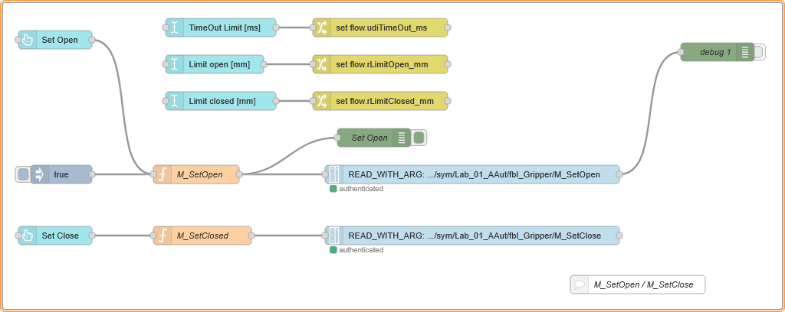
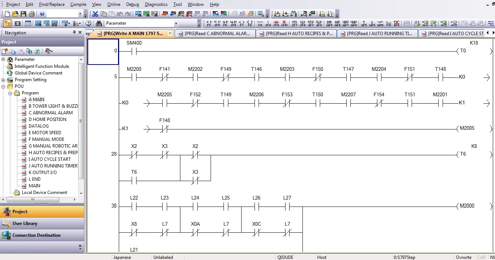
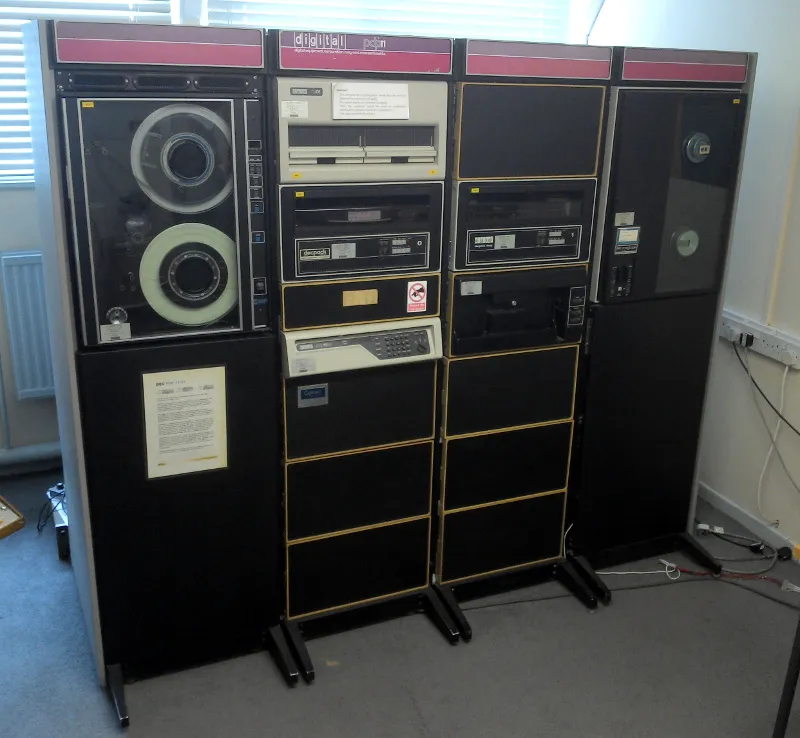
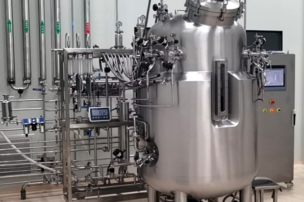
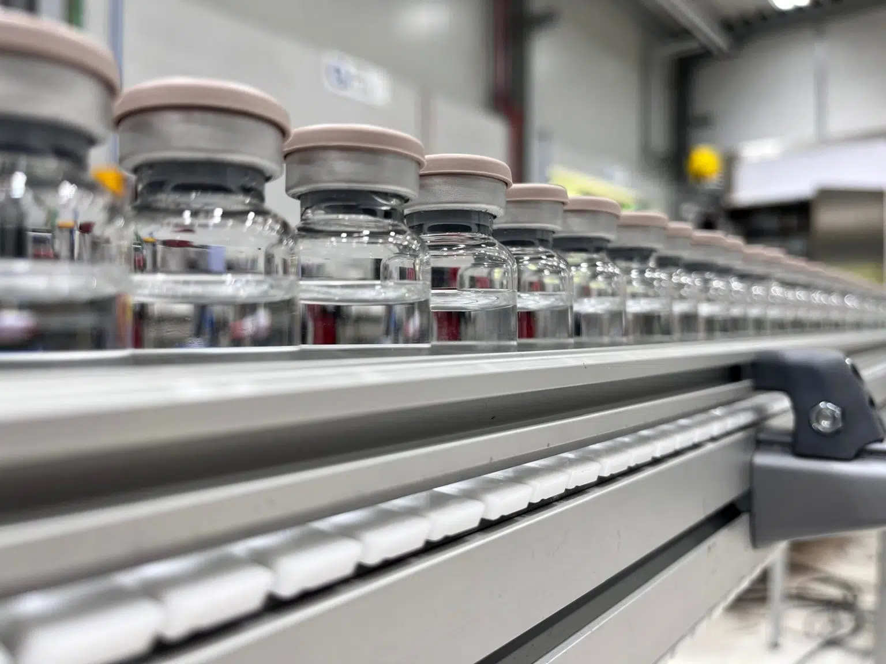
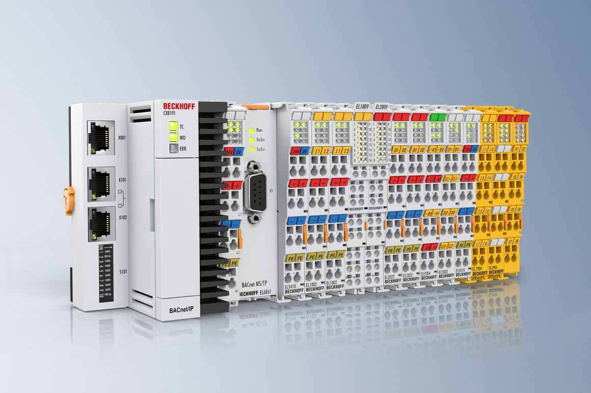
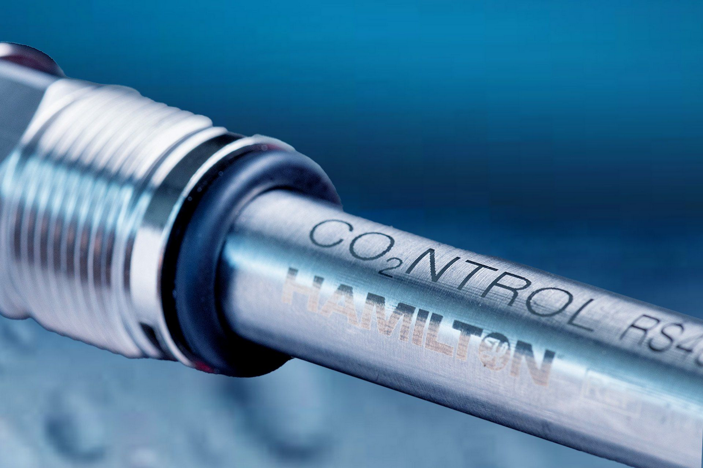
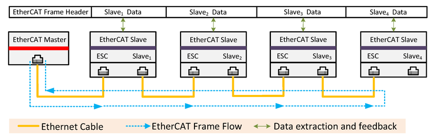
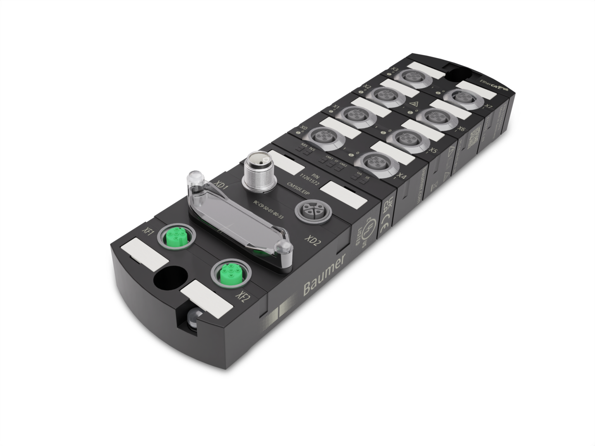

<h1>
  
  <br> ADP
    <h2>Industrial Automation</h2>
  <br>
</h1>

Author: [Cédric Lenoir](mailto:cedric.lenoir@hevs.ch)

## Introduction

### Table of Contents

- [Introduction](#introduction)
- [What is a PLC?](#what-is-a-plc)
  - [Notion of cycle time](#notion-of-cycle-time)
  - [Other 61131 Concepts](#other-61131-concepts)
    - [61131-2](#61131-2)
    - [61131-9](#61131-9)
- [Fieldbuses](#fieldbuses)
  - [Why are you concerned by fieldbuses?](#why-are-you-concerned-by-fieldbuses)
  - [What is a fieldbus?](#what-is-a-fieldbus)
  - [Modbus RTU](#modbus-rtu)
  - [IO-Link](#io-link)
  - [EtherCAT](#ethercat)
  - [Ethernet-APL](#a-few-words-about-ethernet-apl)
- [Summary](#summary)
  - [Cycle time and fieldbus](#cycle-time-and-fieldbus)
  - [PLC and IACS](#plc-and-iacs)


In this first module, we will first make the link with what we can consider as laboratory automation, then automation in production and finally automation as we propose it in the HEVS automation laboratory.

<div align="center">
<figure>
  
  <figcaption>Automatisation Box @ HEVS</figcaption>
</figure>
</div>

<div align="center">
<figure>
  
  <figcaption>NIST Living Measurement Systems Foundry, Credit: J. Stoughton/NIST</figcaption>
</figure>
</div>

> [NIST](https://www.nist.gov/) is the US National Institute of Standards and Technology.

<div align="center">
<figure>
  
  <figcaption>Chemspeed End-to-End Automated NMR and LCMS Sample Preparation. Souerce: <a href="https://www.chemspeed.com/example-solutions/end-to-end-nmr-and-lcms-sample-preparation/">Chemspeed</a></figcaption>
</figure>
</div>

> Chemspeed FLEX is a modular laboratory automation platform made by [Chemspeed Technologies, CH](https://www.chemspeed.com).

In reality, from an automation perspective, whether it's the NIST measurement systems, the Chemspeed platforms, or the 23.N411 laboratory cells, the technologies implemented are broadly the same. What will change are mainly the technologies of the tools used, which move beyond the field of automation to the field of instrumentation.

Next, we will present some key technologies that will help you understand why we are introducing the concept of PLCs and some fieldbuses and their specific features.

> PLC for **programmable logic controller**. Let's now consider a type of computer used for cyclical tasks in industrial applications. We will then develop the concept of a PLC in more detail.

At the end of the module, we will introduce the conveyor, explaining why we are using this relatively simple module and why it is important to us.

<div align="center">
<figure>
  
  <figcaption>Conveyors in the NIST Living Measurement System Foudry, Credit: J. Stoughton/NIST</figcaption>
</figure>
</div>

Sometimes you could buy a complete measurement cell with COTS software, COTS software means Commercial Off-The-Shelf software, ready to use. But it could happen that for a POC, that is a Proof of Concept system, a small-scale, preliminary implementation of a technology, process to Demonstrate feasibility, test assumption and reduce risk to identify potential issues before investing more time and money.

A conveyor is typically a system controlled by a PLC.

<div align="center">
<figure>
  
  <figcaption>Conveyor for the Automation Lab @ HEVS</figcaption>
</figure>
</div>

Another kind of device typically driven by a PLC is a gripper. The gripper is not only an On/Off system with two lines of Python Code.

<div align="center">
<figure>
  
  <figcaption>Gripper In The NIST Living Measurement System Foundry Credit: J. Stoughton/NIST</figcaption>
</figure>
</div>

> A **gripper** is a type of end-effector, tool attached at the end of a robot arm, that allows the robot to grasp, hold, and release objects.

```py
import robot

robot.OpenGripper()
robot.CloseGripper()
```

Or it could, but generally, you need a PLC because the gripper must be controlled continuously. The gripper must be continuously monitored by a sensor to ensure that its position and status are always known. This is also the job of a PLC.

<div align="center">
<figure>
  
  <figcaption>Gripper in an Automation Box of the lab in HEVS.</figcaption>
</figure>
</div>


When the gripper is controlled by the PLC, it will be possible to send commands to the PLC from higher level language or Low-Code language. Low-Code / No-Code will be developed in the next module of this course.

<div align="center">
<figure>
  
  <figcaption>No Code open-close sequence for a gripper.</figcaption>
</figure>
</div>

The main goal of this first module and first lab is to understand the main differences between low level PLC code and high level code / no-code.

Before even talking about PLCs, we need to be clear on one point. Is a PLC limited to operations as simple as grippers and conveyors? The answer is clear: **no!**

There are possibilities to run vision and machine learning systems on industrial automations that are no longer really PLCs, this is a little beyond the scope of this course, but we will briefly touch on the subject.

<div align="center">
<figure>
  
  <figcaption>You could run Machine Learning models on core of the HEVS lab.</figcaption>
</figure>
</div>

There is still one area where PLCs are very effective, and that is for everything related to regulation, as long as it is not too rapid, which is the case for processes in biotechnology.

<div align="center">
<figure>
  
  <figcaption>Bioreactor with control of coolant flow and reactor inlet temperature Source : <a href="https://www.mdpi.com/2227-9717/13/9/2758">MDPI</a>.</figcaption>
</figure>
</div>

# What is a PLC?

It's important to take a look at some history. The first PLCs were designed to perform very simple operations that could be represented by contact lists, which are ultimately just logical operators.

<div align="center">
<figure>
  
  <figcaption>Ladder programming</figcaption>
</figure>
</div>

> In the example above, virtual contacts in series are Boolean AND operators, in parallel are OR operators and the results are virtual relay coils.

This type of programming, which dates back to the first PLCs in the 1980s, is still widely used for simple automation tasks. Virtual contacts and relays replaced relay cabinets. In the 1980s, these PLCs served as intelligent terminal blocks controlled by more powerful PDP-11 minicomputers that occupied several cabinets.

<div align="center">
<figure>
  
  <figcaption>The supercomputer designed to control PLCs</figcaption>
</figure>
</div>

The reality is that in 2025, the processor of any PLC is thousands of times more powerful than a control panel from the 1980s.

In 2026, a PLC is most often just one application among others that uses part of a processor core.

What interests us is that a PLC application is primarily designed to execute one or more tasks with fixed cycle times.

This is why, if I want to keep the concept of PLC, I prefer to use the concept of IACS for **Industrial Automation Control Systems** in 2026.

<div align="center">
<figure>
  
  <figcaption>A PLC into an IACS</figcaption>
</figure>
</div>

PLC programming languages ​​are standardized according to **IEC-61131-3**. These include graphical, no-code languages ​​such as virtual contacts, and a relatively high-level language based on Pascal with object-oriented functions, Structured Text. Currently, only the object-oriented Structured Text component is taught in HEVS Industrial Systems.

## Notion of cycle time
When we talk about industrial automation systems, we often come across the concept of cycle time. Here are some examples of cycle times to intuitively understand what it is.

### Summary Table of Cycle Times

| Application | Cycle Time / Sampling Rate        |
|-------------|:---------------------------------:|
| Voice on smartphone           | < 0.1 ms (16 kHz) |
| Robot position control / assembly machine     | 1 ms|
| Temperature regulation, e.g. small bioreactor| 1 s|
| Piece counting on conveyor, 600/min| 10 ms |

#### Temperature regulation of a bioreactor

<div align="center">
<figure>
  
  <figcaption>Temperature regulation with cycle time of about 1 [s]
, Source: <a href="https://blanc-labo.com/fermenteurs-et-bioreacteurs-pilotes-en-inox.html">Blanc labo</a></figcaption>
</figure>
</div>

#### Piece counting on syringe conveyor
<div align="center">
<figure>
  
  <figcaption>Cycle time of about 10 [ms]
, Source: <a href="https://www.cilyx.eu/en/solution/handling-conveyors/">Cilyx</a></figcaption>
</figure>
</div>

#### Assembly of pharmaceutical devices
<div align="center">
<figure>
  
  <figcaption>High speed assembly machine, about 1 [ms]
, Source: <a href="https://www.mikron.com/en/automation/systems/">Micron</a></figcaption>
</figure>
</div>

#### Summary

- The choice of cycle time depends on the dynamics of the process to be controlled.
- A cycle time that is too slow can lead to missed fast events, e.g., piece counting.
- A cycle time that is too fast can unnecessarily overload the system without performance gain.
- Adapting the cycle time to the application helps optimize the performance and reliability of the automation system.

We speak also of **latency time** communication delay between action and observable effect. We need many cycles between action and effect. So latency time is higher than cycle time.

## Other 61131 Concepts
We will briefly cover IEC 61131-3 programming in the next module. The goal is to get hands-on with programming in order to better understand some of its concepts.

However, IEC 61131 is not just a programming language; without covering all its aspects, there are two that interest us here:

### 61131-2
The **IEC 61131-2** standard, Part 2 of the IEC 61131 series, defines the **hardware requirements for programmable controllers, PLCs, and their associated equipment**.

At the level of **interfaces**, it specifies:

---

### Electrical and signal interfaces

* **Standardized logic levels**: voltage and current thresholds for recognizing **digital inputs and outputs**.
* **Input characteristics**:

  * Permissible input voltage range,
  * Typical input current,
  * Minimum input impedance,
  * Noise immunity (against disturbances and bouncing).
* **Output characteristics**:

  * Load capability (resistive, inductive),
  * Rated and maximum output current,
  * Voltage drop when conducting,
  * Leakage current when switched off.

---

### EMC and safety requirements

* Defines **EMC robustness tests** (immunity to electrostatic discharges, surges, RF disturbances).
* Requirements for **short-circuit and overload protection** on outputs.
* **Galvanic isolation** between different parts of the system.

---

### Interface classifications

The standard also introduces **categories of inputs and outputs** depending on their electrical behavior, for example:

* **Input types 1, 2, and 3** (differentiated by input current consumption and noise immunity).
* **Output types**, transistor, triac, relay with standardized performance criteria.

---

✅ **In summary**: IEC 61131-2 defines the **electrical, functional, and EMC requirements for PLC input/output interfaces**, ensuring **interoperability and reliability** across equipment from different manufacturers.


## Digital Input [Source Siemens 2015](https://cache.industry.siemens.com/dl/files/921/109477921/att_862667/v3/109477921_Compliance_IEC_61131-2_DI_module_de.pdf)
|Signal range     |Type 1|Type 2|Type 3|
|-----------------|------|------|------|
|24 [Vdc]	      |...   |...   |...   |
|120 [Vac]	      |...   |...   |...   |
|230 [Vac]	      |...   |...   |...   |

To my knowledge, the 5 [Vdc] signal is not part of the input specification, but this voltage level is available from some manufacturers, for example [Beckhoff EL1124](https://www.beckhoff.com/en-en/products/i-o/ethercat-terminals/el1xxx-digital-input/el1124.html).

## Digital Output
transistor, triac, relay...

## Analog Input
|Signal range     |Input impedance limits|
|-----------------|----------------------|
|± 10 [V]	|≥ 10 [kΩ]|
|0-10 [V]	|≥ 10 [kΩ]|
|1-5 [V]	|≥ 5 [kΩ]|
|4-20 [mA]	|≤ 300 [Ω]|

## Analog Output
|Signal range     |Input impedance limits|
|-----------------|----------------------|
|± 10 [V]	|≥ 1000 [Ω]|
|0-10 [V]	|≥ 1000 [Ω]|
|1-5 [V]	|≥ 500 [Ω]|
|4-20 [mA]	|≤ 600 [Ω]|

#### Some examples

##### A typical PLC with some inputs and outputs according IEC 61131-2.

- In the documentation, only inputs are referenced according IEC 61131-2
- Analog inputs are 0..10[V]
- Analog outputs are 0..10[V]
- For digital outputs, only the max. DC current is given, 500 [mA]

Various other interfaces are presents.


<div align="center">
<figure>
  
  <figcaption>Wago Compact Controller, Source: <a href="https://www.wago.com/fr/contrôleur/contrôleur-compact-100/p/751-9301#details">Wago</a></figcaption>
</figure>
</div>

##### Another typicall PLC with various interface cards.

In this second example, the PLC in embedded with a Windows system and some interface cards. If you have a look at the website of the supplier, you will read that there is a **lot** of various Input/Output cards.

<div align="center">
<figure>
  
  <figcaption>Beckhoff CX8191 Embedded PC, Source: <a href="https://www.beckhoff.com/en-en/products/ipc/embedded-pcs/cx8100-arm-r-cortex-r-a9/cx8191.html#:~:text=The%20CX8191%20is%20a%20control%20system%20with%20a,of%20I%2FO%20system%20connected%20during%20the%20start-up%20phase.">Beckhoff</a></figcaption>
</figure>
</div>

<span style="color: red;">**You should remember that**:</span>

- **The bright side** of the PLC world is that
  - there is a lot of various input/output cards, ready to be connected to your PLC.
  - If you choose the PLC and the card from the same catalog, the interface will generally be very simple to implement. It's not Plug & Play, though, **so don't dream**.

- **The dark side** of the PLC world is:
  - It is not easy to select the right I/O card for the right sensor or actuator.
  - The hardware of the various suppliers is generally not compatible with the hardware from others.
  - Even if you select the right card with the right sensor, you could spend weeks to write the interface, see Modbus below.


<span style="color: red;">**In other words, be careful, the interface is a critical point of any automation project**:</span>

In some cases, the choice of PLC will depend on the hardware you want to connect to. Some providers are more specialized in certain sectors.

---

### 61131-9

**IEC 61131-9** is part of the **IEC 61131 series**, but instead of focusing on the PLC hardware itself, it defines a **communication interface**:

#### 🔹 IEC 61131-9 – Single-drop digital communication interface for small sensors and actuators.

* Commonly referred to as **IO-Link**.
* Specifies a **point-to-point communication standard** between a PLC, or IO-Link master and field devices like sensors and actuators.
* It extends traditional binary I/O, on/off signals by enabling **bidirectional digital communication** over the same wiring.

<div align="center">
<figure>
  
  <figcaption>Understanding IO-Link principle, Source: <a href="https://www.ifm.com/us/en/shared/technologies/io-link/technology/technology">Ifm</a></figcaption>
</figure>
</div>

> First advantages : An IO-Link system generally offers good noise immunity and the converter is optimized to the characteristics of the sensor.

> Second advantage : You can use the digital channel to configure the sensor, see parameter data below. 

---

### 🔹 Key features

* **Standardized communication**: Works with all IO-Link–compatible sensors/actuators regardless of manufacturer.
* **Data exchange**:

  * Process data, real-time values, setpoints.
  * Parameter data, configuration, calibration).
  * Diagnostic data (status, errors, device health).
* **Physical layer**: Uses the same 3-wire connection as standard sensors, making it cost-effective.
* **Master–device concept**:

  * The **master**, e.g., PLC module connects to one or more **devices**, sensors/actuators.
* **Plug-and-play**: Devices can be automatically identified and configured. *Generally, on the PLC side, this is not Plug-and-play...*.

---

✅ In short:
**IEC 61131-9 defines IO-Link, a standardized digital communication protocol for connecting smart sensors and actuators to PLCs, enabling more than just simple on/off signals.**

<div align="center">
<figure>
  
  <figcaption>Very often the IO-Link Master is connected to the PLC using an Ethernet Real-Time like EtherCAT, see below, Source: <a href="https://www.ifm.com/ie/en/shared/technologies/io-link/io-link-modules/benefits">Ifm</a></figcaption>
</figure>
</div>

---


# Fieldbuses
The objective here is not to review all fieldbuses. It is primarily to illustrate their variety and the importance of choosing the right fieldbus when designing an automation system.

> The fieldbus is the main link between the PLC and the sensors and actuators. Choosing the most suitable technology is one of the keys to the success of an automation project.

## Why are you concerned by fieldbuses?
It's likely that you won't be involved in programming the system that uses the sensor you choose. However, when analyzing the purchase price of your sensor, it's worth considering how much time the industrial systems engineer will spend installing it.

Based on a specific case, three types of technologies are presented below:

|Technology |Estimed integration time|
|-----------|----|
|EtherCAT|    1 hour|
|IO-Link|    1 day|
|Modbus RTU| 1 week|

Then you can give an answer to: <span style="color: red;">Which is the most economical sensor?</span>

## What is a fieldbus?

A **fieldbus** is a digital communication system used to connect sensors, actuators, and other devices to a PLC in an industrial environment. It enables fast and reliable data exchange between field devices and the control system, **reducing wiring** and **facilitating maintenance**.

### Comparison of some fieldbuses

| Fieldbus | Communication type |Topology | Typical use cases | Strengths |
|----------|--------------------|---------|-------------------|--------------|
| **EtherCAT** | Real-time Ethernet |Usually linear | Complex machines, fast automation | Very short cycle time, precise synchronization, management of numerous I/Os |
| **IO-Link** | Point-to-point|Point-to-point | Smart sensors/actuators | Remote parameterization, advanced diagnostics, easy integration |
| **Modbus RTU** | Serial, RS-485 |Point-to-point, bus | Simple automation, monitoring | Simplicity, broad compatibility, open and robust |

- **EtherCAT** is suitable for applications requiring very fast and synchronized data exchange, such as robots or machine tools.
- **IO-Link** is designed to connect smart sensors and actuators, enabling remote configuration and diagnostics while remaining easy to integrate.
- **Modbus** is a historical, simple, and widely used protocol for applications where speed is not critical, but robustness and [compatibility are important](#compatibility-is-important).

#### Compatibility is important
It does not mean easy, it only means, it will be possible. T**he nuance is important**.

Each fieldbus has its advantages depending on the industrial context, the type of devices to be connected, and the performance requirements.

---

## Modbus RTU 
Modbus RTU is a **serial communication protocol** used in industrial automation systems for transmitting data between electronic devices over a network.

### 🔹 What is Modbus

* **Modbus** is an open communication protocol developed by Modicon (now Schneider Electric) in 1979.
* It’s widely used for communication between **PLC (Programmable Logic Controllers)**, **RTUs, Remote Terminal Units**, sensors, meters, and other industrial devices.
* It defines how information is structured, addressed, and transmitted.

### 🔹 What RTU means

* **RTU = Remote Terminal Unit** format.

### 🔹 How Modbus RTU works

* **Communication medium**: RS-232, RS-485, most common, allows multi-drop networks.

<div align="center">
<figure>
  
  <figcaption>Modbus RTU network, Source: Siemens</figcaption>
</figure>
</div>


* **Master-Slave architecture**:

  * One device is the **master** usually a PLC.
  * Other devices are **slaves**, sensors, actuators.
  * The master sends queries, and slaves respond with data. Slaves never talk unless asked.
* **Message structure**:

  * Address, which device to talk to
  * Function code what action to perform, e.g., read/write data.
  * Data, the values to send or request,
  * CRC, Cyclic Redundancy Check, for error detection.

### 🔹 Example use cases

* Reading temperature, pressure, or flow from a field sensor.
* Sending control commands to drives, relays, or actuators.

### 🔹 Key features

* Simple, open, and widely supported.
* Low-cost to implement.
* Limited to relatively slow baud rates, commonly 9600 or 19200 bps.
* Works well for small-to-medium automation systems.

✅ In short: **Modbus RTU is a serial protocol that lets a master device query and control multiple slave devices in industrial networks, using binary data packets over RS-485/RS-232.**

⚠️ In reality: the Modbus RTU standard is very flexible.
  - Each device can be set with various baud rate.
  - Each device can have various frame format.
  - The organisation of registers is different for each device.
  - The order, and even start register number can be different.
  - The device identification is complicated, the default address can be different for every supplier

- **The bright side**: it is possible to connect Modbus RTU with **anything**.
- **The dark side**: every manufacturer can do **anything**.

As Modbus is ultimately rudimentary and simple to implement for the manufacturer, it is still often found among certain sensor manufacturers who work in niche sectors.

<div align="center">
<figure>
  
  <figcaption>Dissolved Carbon Dioxide, CO₂ Sensors with Modbus interface, Source: <a href="https://www.hamiltoncompany.com/process-analytics-sensors/dissolved-carbon-dioxide-sensors?utm_source=bing-cpc&utm_medium=ppc&utm_campaign=product&utm_term=co2ntrol&utm_content=generic&utm_term=Hamilton%20CO2NTROL%20Sensor&utm_campaign=MS+Process+Analytics+%7C+Search+%7C+Sensors++%7C+CO2+-+EU+/+UK&utm_source=bing-cpc&utm_medium=ppc&hsa_cam=518700732&hsa_grp=1323813657508378&hsa_ad=&hsa_src=o&hsa_tgt=kwd-82739281880130:loc-175&hsa_kw=Hamilton%20CO2NTROL%20Sensor&hsa_mt=e&msclkid=06dc8b83e03819449abee35178d0d7af">Hamilton</a></figcaption>
</figure>
</div>

When each supplier can propose its own register organisation, IO-Link is very well organized with a centralized website with the data structure of every supplier. Some software can download directly the structure of the data from this website. 
The [IODD, IO Device Description](https://io-link.com/technology/iodd) is a powerful tool that significantly simplifies the commissioning, operation, and maintenance of an IO-Link systems. [See IO-Finder too](https://ioddfinder.io-link.com).

## IO-Link
We have seen IO-Link when speaking about [IEC-61131-9](#61131-9).

<div align="center">
<figure>
  
  <figcaption>IO-Link in process automation
, Source: <a href="https://www.ch.endress.com/en/digitalization/smart-manufacturing-digitalization/ethernet-based-communication-environments/IO-Link?store_locale=en">Endress + Hauser</a></figcaption>
</figure>
</div>

<span style="color: red;">IO-Link is the preferred protocol to select for integrating a sensor into an automation platform.</span>

## EtherCAT
EtherCAT is one of many industrial Ethernet Real-Time.

## What is Real-Time Ethernet?

Real-Time Ethernet refers to Ethernet communication protocols designed to meet the strict synchronization and determinism requirements of industrial automation systems. Unlike standard Ethernet, which operates on a best-effort basis, Real-Time Ethernet guarantees predictable, low-latency communication, making it ideal for time-critical applications.

> Example of an EtherCAT device. High-precision thermal mass flow meters & mass flow controllers for gases.

<div align="center">
<figure>
  
  <figcaption>Voegtling mass flow controller with EtherCAT.
, Source: <a href="https://www.voegtlin.com/en/mass-flow-meters-and-controllers-for-gases/red-y-smart-series/">Voegtlin</a></figcaption>
</figure>
</div>

### Real-Time Ethernet
In the early 2000s, a whole series of competing products entered the market, so much so that The Industrial Communication Technology Handbook, published in 2005, referred to it as The Industrial Fieldbus War. The reality, much to the disappointment of the automation world, is that the major market players, despite several attempts, have been unable to agree on a standard.

#### IEC 61784
There is indeed a series of standards under the umbrella of number 61784, but unfortunately there are about as many variations of the standard as there are types of Real-Time Ethernet fieldbuses.
This shows that standards and standardization are not synonymous…

#### Choosing Your Bus
At the design level, and this is why I place the fieldbus before the PLC, the automation engineer will sometimes choose their development platform not based on the PLC's performance, but on the equipment available for a given fieldbus.

Real-time Ethernet is, above all, a protocol and a software layer that is grafted onto standard Ethernet hardware, RJ45 port. This is only partially true, but there are implementations that allow Real-Time Ethernet to work on standard PCs.

#### Performance
To be somewhat simplistic, the performance of the "Real-Time Ethernet" fieldbus can generally be considered "sufficient" as long as the amount of data transmitted in real time remains reasonable. We're talking about a few dozen bytes per cycle and per "slave."

The bandwidth-hungry devices are generally motor controllers. The number of analog inputs can be quite significant.

Generally speaking, it can be estimated that for a cycle time of around a millisecond and a few dozen motors or other nodes on the network, it is unlikely to encounter any limitations. The PLC will probably reach its limits before the bus.

#### Security

Most current real-time buses can now be used for wiring safety components. This is the secure protocol between two points.

#### Secondary Networks, Field Bus

<div align="center">
<figure>
  
  <figcaption>PLC to IO-Link via EtherCAT
, Source: <a href="https://community.boschrexroth.com/home">Bosch Rexroth</a></figcaption>
</figure>
</div>

### Concretely?
Unlike standard Ethernet, where the time between two frames can vary, Real-Time Ethernet frames, as described below, are divided into frames sent and received according to a fixed cycle time. Jitter is as small as possible, and the latency time is very short, here $\ 2[ms]$.

✅ In short:
  - The EtherCAT master sends a frame at a fixed time that passes through all the slaves. Each slave:
  - extracts the information intended for it, *receives*
  - inserts the information it wants to send, *transmits*
  - then passes the frame to the next slave.

<div align="center">
<figure>
  
  <figcaption>EtherCAT system and “on the fly” mechanism
, Source: <a href="https://www.researchgate.net/publication/364032773_A_Novel_Heterogeneous_Parallel_System_Architecture_Based_EtherCAT_Hard_Real-Time_Master_in_High_Performance_Control_System">ResearchGate</a></figcaption>
</figure>
</div>

If we compare Real-Time Ethernet to a traditional fieldbus, its advantage is that it leaves room for transferring traditional Ethernet-type information.

EtherCAT embeds its payload in a standard Ethernet frame. Since the EtherCAT protocol is optimized for short cyclic process data, the use of protocol stacks, such as TCP/IP or UDP/IP, can be eliminated.

<div align="center">
<figure>
  
  <figcaption>EtherCAT embeds standard Ethernet payload in its cyclic frame
, Source: <a href="https://www.ethercat.org/en/technology.html#1">EtherCAT.org</a></figcaption>
</figure>
</div>

### Limitations
- The cycle time is configured at network startup and cannot be changed online without temporarily interrupting the network.
- **Only one cycle time is possible**. This means that you cannot have a communication at $\ 2 [ms]$ and another at $\ 200 [ms]$ on the same network.
- There must be at least one Master synchronizing Slaves.
- In *true* Real-Time, the network topology is *often* limited to a serial connection of all Slaves, unless additional hardware is installed.
- Commissioning a Real-Time Ethernet network can be relatively complicated; **it is not Plug and Play**.

<div align="center">
<figure>
  
  <figcaption>Flexible topology – line, tree or star
, Source: <a href="https://www.ethercat.org/en/technology.html#1">EtherCAT.org</a></figcaption>
</figure>
</div>

- Note: a single master on the right. On the far left, for EtherCAT only. **If you want to connect to an EtherCAT port from a traditional Ethernet port, you must use a gateway.**

### Real-Time Ethernet Use Cases
**Industrial Automation**
- Motion control coordination in robotics and CNC machines.
- Synchronization of conveyor systems in manufacturing lines.

**Process Control**
- Real-time monitoring and control of sensors and actuators.
- Ensuring precise synchronization in chemical or pharmaceutical processes.

**Energy Systems**
- Management of smart grids and renewable energy systems.
- Real-time monitoring of electricity distribution networks.

**Automotive and Transportation**
- Implementation of advanced driver assistance systems (ADAS).
- Real-time communication in autonomous vehicles.

<div align="center">
<figure>
  
  <figcaption>IO-Link Master for EtherCAT, Source: <a href="https://www.ch.endress.com/en/digitalization/smart-manufacturing-digitalization/ethernet-based-communication-environments/IO-Link?store_locale=en">Baumer</a></figcaption>
</figure>
</div>

### Compatibility
⚠️ Please note that different protocols from different manufacturers are not compatible with each other. In Switzerland, **Profinet** and **EtherCAT** dominate the market. **Modbus TCP** is still possible, but does not guarantee precise cycle times.

- **PROFINET, RT, IRT**: Used primarily in industrial automation, primarily Siemens.
- **EtherCAT**: Designed for applications requiring strict real-time, primarily Beckhoff.
- **Modbus-TCP**: An extension of the Modbus protocol for Ethernet, developed by Schneider Electric, **not usable in motion control**.
- **POWERLINK**: An open real-time Ethernet protocol, almost exclusively B&R, now owned by ABB. - **CC-Link IE**: Used for high-performance industrial networks, at Mitsubishi, Japanese market.
- **SERCOS III**: Specialized in motion control, based on Bosch Rexroth. Abandoned by Bosch Rexroth in favor of EtherCAT.
- **EtherNet/IP**: Based on the Allen Bradley CIP protocol for industrial automation, especially in the American market.

These protocols are adapted to different needs in terms of performance, latency, and compatibility.


## A few words about Ethernet-APL
[Ethernet-APL, Advanced Physical Layer, Two-Wire Ethernet For Process Automation](https://www.ethernet-apl.org/) is a very recent technology. The first devices appeared on the market in 2021. It allows Ethernet to be brought into the world of process automation, for example, in chemistry with a two-wire network layer.
It is probably too early to know if this technology will really take off.

**Ethernet-APL does not provide the same real-time qualities as true Real-Time** in terms of **latency time** and **jitter**. It is not designed for that.

**It is a little early to know if this technology will really take off**.

<div align="center"> 
 
<figcaption>From Hazardous Areas to the Enterprise with Ethernet APL, Source: <a href="https://www.ethernet-apl.org">Ethernet-apl.org</a></figcaption>
</div>

# Summary
## Cycle time and fieldbus
Now that we know what a cycle time is and have an overview of what fieldbuses are, we can compare them to each other.

- **Latency** → one-way transmission delay, **how long it takes a message to arrive**.

- **Cycle time** → periodicity of updates, **how often data is refreshed**.

- **Jitter** → the variation in timing, **how much the cycle length or latency fluctuates**.

- **Baud rate** → Number of symbols transmitted per second over a communication line

### ⚡ EtherCAT

* **Principle**: Real-time Ethernet fieldbus.
* **Cycle times**: As low as **100 µs**, common in **100–500 µs** range.
* **Latency**: Typically **< 100 µs** from master to slave and back.
* Very deterministic: jitter in the **sub-microsecond** range.

---

### 🔗 Modbus (TCP & RTU)

* **Modbus RTU (RS-485)**:

  * Serial protocol, limited by baud rate.
  * Response times typically **10–100 ms**, depending on baud, message size, and number of nodes.
  * Latency is in the **tens of ms**.
* **Modbus TCP**:

  * Runs over Ethernet/TCP stack, non-real-time.
  * Latency typically **several ms**, e.g. 2–10 ms typical, can be lower on optimized stacks.
  * Jitter can be high since it uses TCP/IP.

---

### 📶 IO-Link

* **Principle**: Point-to-point, master ↔ sensor/actuator, over 24V 3-wire connection.
* **Cycle times**: Typically **2.3 ms – 5 ms** per cycle, depends on baud rate.
* **Latency**: In practice, **a few ms**, usually **2–5 ms**.
* Less deterministic than EtherCAT, but more predictable than Modbus TCP.

---

### 📊 Summary Table, typical values

| Protocol       | Typical Latency | Notes                                             |
| -------------- | --------------- | ------------------------------------------------- |
| **EtherCAT**   | < 100 µs – 1 ms | Very deterministic, sub-ms control loops possible |
| **Modbus RTU** | 10–100 ms       | Slow, depends on baud rate                        |
| **Modbus TCP** | 2–10 ms         | Faster than RTU but non-deterministic             |
| **IO-Link**    | 2–5 ms          | Point-to-point, moderate latency                  |

---

## PLC and IACS
A PLC is:
1. A module to execute cyclic code on the processor of an IACS
2. An environment to connect various inputs/output directly or via fieldbuses
3. As we will discover in the lab N° 1, an IDE Integrated Development Environment to program a system without breakpoints.

> When programming, commissioning and maintaining the program on the machine we cannot stop it. So it is important to monitor it in real-time.


<!--End of file-->