<h1>
  
  <br> ADP
    <h2>IEC-61131-3</h2>
  <br>
</h1>

Author: [Cédric Lenoir](mailto:cedric.lenoir@hevs.ch)

# Module 02 PLC programming quick start

*Keywords:* **Variables / Instructions / Cycle Time / Types / Triggers / Timers**

<figure>
    
    <figcaption>Logo International Electrotechnical Commission</figcaption>
</figure>


## Programmable controllers - Part 1: General information

## Abstract, www.iec.ch
IEC 61131-1:2003 applies to programmable controllers, **PLC** and their associated peripherals such as programming and debugging tools, PADTs, human-machine interfaces, **HMI**s, etc., which have as their intended use the control and command of machines and industrial processes. It gives the definitions of terms used in this standard. It identifies the principal functional characteristics of programmable controller systems. This second edition cancels and replaces the first edition published in 1992 and constitutes a technical revision. *This bilingual version (2012-05) corresponds to the monolingual English version, published in 2003-05*.

# Objective

This module is intended to present the basic concepts necessary to approach the first practical work.
- [Cyclic System](#basic-principle)
- [Variables](#variables)
- [The base types](#base-types)
- [Triggers](#function-block-r_trig-et-f_trig)
- [Timers](#function-block-ton-tof-et-tp)

> At the end of the module, you should be able to manage a conveyor.

<div align="center">
<figure>
  
  <figcaption>Conveyor in pharma industry, source: <a href="https://www.pharmastandort.at/">Pharmig: AT</a></figcaption>
</figure>
</div>

# IEC 61131-3 Languages
This section on languages ​​is provided for informational purposes. We will only use the Structured Text language, which will be covered in detail later in this course.

## The standard defines several types of language
### Le Ladder Diagram LD
For representing physical contacts. Typically, for example, to represent the state of many circuit breakers and electrical contactors for a building's power supply. **This language is unusable, or almost unusable, for running algorithms and signal processing**.

<div align="center">
<figure>
    
    <figcaption>Ladder Programming Source: <a href="https://www.siemens.com/global/en/products/automation/systems/industrial/plc.html">Siemens</a></figcaption>
</figure>
</div>

> The ladder is still very common in some industries. Some studies shows that it is even still the most widely used in United States. 

### The Sequential Function Chart SFC
**Derived from the mathematical model of Petri nets**. Can be useful for representing a process that occurs according to a list of well-defined and uncomplicated sequences. Quickly becomes unmanageable if the number of sequences increases. Its use is anecdotal. We will not use it.

> This language can be very useful for procedural control, that is, for something else than strict cyclical programming. But this is out of the scope of this course.

<div align="center">
<figure>
    
    <figcaption>SFC Programming Source: <a href="https://www.beckhoff.com/fr-ch/">Beckhoff</a></figcaption>
</figure>
</div>

### The Function Block Diagram FBD
As its name suggests, it is dedicated to the representation of **Function Blocks, FB**. It is useful for representing a chain of regulators. It is also used for programming safety relays for which a series of parameterized blocks is mainly used. Suitable for representing algorithms at the macroscopic level, but not for writing the algorithm itself. **We will sometimes use it to model a program, but not for writing programs.**

<div align="center">
<figure>
    
    <figcaption>Function Block Programming Safety, Source: <a href="https://www.sick.com/ch/en/safety/c/g296181">Sick</a></figcaption>
</figure>
</div>

### Instruction List
IL is similar to a kind of assembly langague. From third edition in 2013, this language is deprecated. Do no use it anymore.

### The Structured Text
Structured Text is inspired by the Pascal language, developed in the 1970s by Professor **Niklaus Wirth** at ETH Zurich. It is a strongly typed and relatively robust language.
Since 2013, with its *third edition*, Structured Text has existed with an object-oriented extension. There is currently no information suggesting a real transformation of the language in the coming years. Just like C for embedded systems, it is very likely that it will remain the basic language for PLC programming for a long time to come. The last know version of IEC 61131-3:2025 does not change a lot about base programming.

> One cannot quote Niklaus Wirth without citing his empirical law: **programs slow down faster than hardware speeds up**.

---

# Basic Principle
What mainly characterizes a programmable automaton, PLC or Programmable Logic Controller is its purely cyclical operation.

## Basically, a PLC has two main characteristics.
> Programs are executed in a **loop**...

> according to a **fixed cycle** time.

This makes them particularly well suited to processing sampled signals, also known as digital processing, advanced digital tuning and, in a relatively new field, running neural networks.

### Why not in Python?
In Python, we can approximate a **fixed cycle time of 1 ms** with a loop that measures the elapsed time and waits for the difference if necessary.

Here's an example:

```py
# If you write a loop in Python.
import time

cycle_time = 0.001  # 1 ms = 0.001 s

while True:
    start = time.perf_counter()

	readInputs()
    # ...
	someAlgortithm()
    # ...
	writeOutputs()

    # Compute elapsed time
    elapsed = time.perf_counter() - start
    sleep_time = cycle_time - elapsed
    if sleep_time > 0:
        time.sleep(sleep_time)

```

#### Explanations:

* `time.perf_counter()` provides a high-resolution measurement.
* We measure the time taken by the iteration and wait until it reaches 1 ms.
* If the code takes longer than 1 ms, the loop runs more slowly (it doesn't "skip" cycles).

⚠️ **Practical Limits**:

* Python is not a real-time language → the accuracy of `time.sleep()` depends on the OS. On Windows, the resolution is often 15 ms, on Linux 1 ms, but **never guaranteed**.
* For true real-time applications, e.g., motor control, we would use C/C++ or Structured Text on an RTOS or PLC. **RTOS** for Real-Time OS.

## Loop System
A controller reads data, processes the data, and transmits the data to an output interface.


> The necessary and sufficient condition for sampling a signal without loss of information is that the sampling frequency **Fs** is greater than or equal to twice the maximum frequency of the analog signal. This principle works as long as the sampling period is as regular as possible.

-   $\ f_s \geq 2f_{max} $

>  In regulation, we would even prefer:

-   $\ f_s \geq 10f_{max} $

In order to take advantage of the computing power of PLCs for numerical control, we require our system to work with a fixed cycle time.

> To my knowledge, the first concrete application of the sampling technique used a frequency of the order of 16 to 18 $\ image/s $ and dates from 1895.

*It's the cinema...*

### Minimum system
In many cases, this architecture is sufficient.

<div align="center">

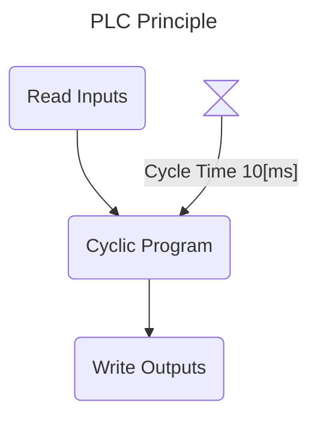

</div>

> The cycle time is managed by an internal clock that generates fixed-cycle-time events to initiate the execution of a program cycle.

The minimum cycle time will depend primarily on the type of process to be automated.
- milliseconds for the machine world.
- seconds for the process world.

Modern industrial automation systems can manage tasks with varying cycle times.

<div align="center">

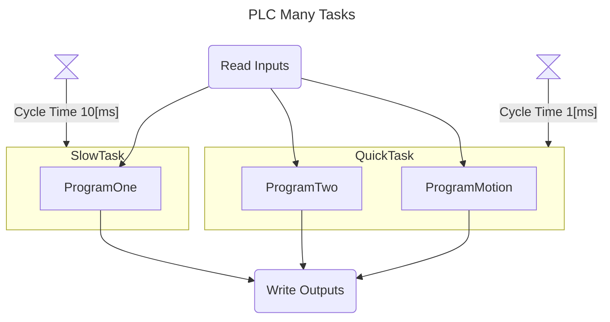

</div>

# Variables
Unlike other types of languages ​​such as **Python**, the PLC standardized according to IEC 61131-3, is strongly typed. This is a matter of robustness.

## Each variable must be declared with its **type**.
```iecst
VAR
    bMyFirstVar     : BOOL;
    strMyFirsText   : STRING;
END_VAR
```

## Each variable must be declared <span style="color: red;">before</span> its use.
In the compiler/IDE we'll be using for this course, variables and code are separated into two separate spaces: variables at the top and code at the bottom.


<div align="center">
<figure>
    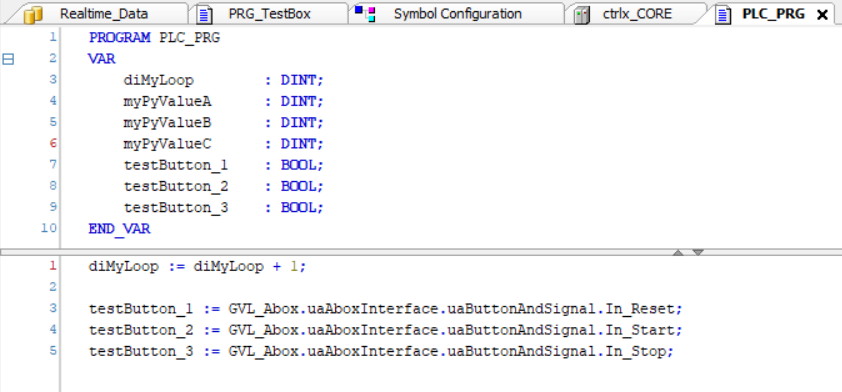
    <figcaption>Variables Before Coding them in a Header</figcaption>
</figure>
</div>

> <span style="color: red;">There is no dynamic allocation in IEC 61131-3.</span>

It is in the management of **interface variables** that the ST language presents its superiority over others in the industrial world. We will see why.

## Input variables
Input variable of the block, the block has the right to write to this variable.

```iecst
VAR_INPUT
    // Set the variable bMyButton to the block.
    bMyButton   : BOOL;
END_VAR
```
## Output Variables
It is not possible to write to an output variable from outside the block in which it is declared.

```iecst
VAR_OUTPUT
    // Get the variable bMyBeeper from the block.
    bMyBeeper   : BOOL;
END_VAR
```

## Input-Output variables
The input/output term is not the primary purpose of this variable. The primary purpose of this type of variable is to pass it by reference, which avoids wasting time copying it from inside to outside the block before its execution and vice versa at the end of the block execution..

```iecst
VAR_IN_OUT
    (*
        Give to the block the address of a buffer.
        With this construction, the block can access to any of the elements
        of the buffer without having to copy 10000 elements
    *)
    aMyBuffer   : ARRAY[1..10000] OF DINT;
END_VAR
```
> The concept of `VAR_IN_OUT` is one of my favorite aspects of the IEC 61131-3 language. This concept will not be covered in this introductory course.

## Simple variables
Simple variables are accessible only within the block in which they were declared, they are internal.

```iecst
VAR
    iMyLoop   : INT;
END_VAR
```

## Global Variables
Global variables are accessible throughout the program.
*They should be used sparingly because they hinder code modularity. A code module that uses a global variable cannot be reused in another program without additions or modifications.*

```iecst
VAR_GLOBAL
    iMyProgramParameter   : INT;
END_VAR
```

## Les constantes
```iecst
VAR CONSTANT
    uiMyArraySize   : UINT := 1024;
END_VAR
```
> Note that
1. Constants are misnamed, since they're called VARs...
1. Constants must be initialized with a value.


## *Variables* Pointers
> Handling pointers is not part of the objectives of this course.

Below, pMyAge contains the address of an INT variable.
Example

```iecst
VAR
    (* Pointer to INT *)
    pMyAge : POINTER TO INT;
END_VAR
```
---

# Base Types
Until a few years ago, people were careful to use *short* variables to save memory space and/or reduce computation time. This is less and less the case today. Most PLC processors operate on 32 or 64 bits.

> However, knowing the size and type of data remains important.

## Example 1
The PLC will communicate with sensors, which are equipped with small microcontrollers whose size is limited. If we want to write to an 8-bit register to configure a limit on the sensor from a 32-bit REAL, we'll encounter a problem.

## Example 2
Despite its age, Modbus remains a widely used communication protocol that operates on 16 bits by default. If you want to transfer a specific 64-bit number, LREAL, you will need to encode and then decode the required number of bytes, but also in the correct order. A misinterpretation could lead to an unknown number that causes the same type of problem as a division by 0, namely a PLC crash.

## Binary
|Data type|Range|Size|
|---------|-----|----|
|BOOL	  |TRUE (1),  FALSE (0)|8 bits (Depends on hardware and compiler)

## Integer
|Data type|Range        |Size|
|---------|-------------|----|
|BYTE     |	0 to 255       |8 bits|
|WORD     |0 to 65535      |16 bits|
|DWORD    |0 to 4294967295 |32 bits|
|LWORD    |0 to much   |64 bits|
|SINT     |-128 to 127     |8 bits|
|USINT    |0 to 255        |8 bits|
|INT      |-32768 to 32767 |16 bits|
|UINT     |0 to 65535      |16 bits|
|DINT     |... to much |32 bits|
|UDINT    |0 to much   |32 bits|
|LINT     |... to much     |64 bits|
|ULINT    |0 to much   |64 bits|

## Floating point
|Data type|Range        |Size|
|---------|-------------|----|
|REAL     |3.402823e+38 to 3.402823e+38|32 bits|
|LREAL    |1.7976931348623158 e+308 to 1.7976931348623158 e+308|64 bits|

## Strings
|Data type|Codage|Base size|
|---------|------|---------|
|STRING   |ASCII |1 byte   |
|WSTRING  |Unicode|2 byte  |

> **A PLC is not designed to process strings**. Strings will only be used for simple functions to display a minimum of information related to the system's operation, such as alarms. Even alarms generally use higher-level routines coded in C/C++ to manage, for example, alarms in several languages.

> -   The new IEC 61131-3:**2025** standard introduces more features for text handling, especially UTF-8, Universal Character Set Transformation Format - 8 bits, but at the time of writing this course, this remains theoretical.

## Date and time
|Data type|Range                                                                |Size|
|-------------------|-----------------------------------------------------------|----|
|TIME	            |0 to 4294967295		                                    |32 bits|
|TIME_OF_DAY	    |0 (23:59:59:000) to 4294967295 (23:59:59:000)	            |32 bits|
|DATE	            |0 (01.01.1970) to 4294967295 (02.07.2106)	                |32 bits|
|DATE_AND_TIME (DT)	|0 (01.01.1970,00:00:00) to 4294967295 (02.07.2106,6:28:15) |32 bits|
|LTIME	            |0 to 213503d23h34m33s709ms551us615ns	                    |64 bits|

> `LTIME` is needed when a timer is to be used in micro or even nanosecond format.

> As with text, the new IEC 61131-3:**2025** standard introduces new functions for generating dates and times. Currently, this quickly becomes complicated to manage.

---

# Choosing the right type

## Size
The ideal type size, especially for Integers, depends on the compiler and the processor.
This may mean that for a given PLC, the ideal Integer is DINT. This is simply because the processor's basic data format is 32 bits, and using another format would involve a time-consuming conversion.

At the time of writing, DINT seems to be the correct basic format. In a few years, LINT may be the standard.

## Bad Idea
Using a SINT to save space isn't really necessary, but ending up with an infinite loop because the loop variable eventually exceeded 127 is silly. Consider a DINT.

## Unsigned Integer
A typical example of an unsigned integer is an enumeration. Its usefulness is limited.

It can even be useful to have a signed type for an enumeration by identifying a negative value. For example, -1 for a quantity not yet used.

## Integers of type BYTE, WORD, DWORD, and LWORD
These quantities are used for registers. Therefore, they are not, in principle, numbers in the strict sense of the term, and should not be used for base-10 calculations.

Their size is chosen based on the register used.

> Variables of type BYTE, WORD, DWORD, and LWORD are used, in particular, to perform logical operations such as AND, OR, etc.

### Binary representation
Base 2
```iecst
    byMyByte    : BYTE := 2#1010_0110;
```
Base 16
```iecst
    byMyByte    : BYTE := 16#A6;
```
### Bitshift Operators

> For information, PLC works at low level and sometimes we need to work at bit level. **We will not use these operators in this module**.

|Operator |Call         |Action|
|---------|-------------|------|
|SHL      |SHL(nInWord,nPos) |Shift *nInWord* by *nPos* bits to the left, bits that go out to the left are lost. | 
|SHR      |SHR(nInWord,nPos) |Shift *nInWord* by *nPos* bits to the right, bits that go out to the right are lost. | 
|ROL      |ROL(nInWord,nPos) |Shift *nInWord* by *nPos* bits to the left, bits that go out to the left go back to the right. | 
|ROR      |ROR(nInWord,nPos) |Shift *nInWord* by *nPos* bits to the right, bits that go out to the right come back in from the left. | 

---

## Datatype according to PLCopen
You can be a supporter of PLCopen without necessarily agreeing with everything.
In its PLCopen Coding Guidelines V1.0 document, § 5.23. Select Appropriate Data Type.

[PLCopen](https://www.plcopen.org/) is an association that manages IEC 61131-3 and provides various coding rules.

### What PLCopen says
- *A correctly data typed variable helps describe its function, making its use somewhat self-explanatory* 
- *"Strongly typed" code, where data type conversions must be explicitly made helps avoid coding mistakes and oversights where some conversion behaviour may not be as assumed, and may be missed by commissioning and testing phases* 
- *Compilers can use the data type to check assignments and instructions use, to ensure operations are as the developer expects* 
- *Smaller data types typically use less memory, so allow for more variables or larger programs* 
- *Using unsigned data types where appropriate prevents any negative value being assigned accidentally, and having to write code, and test the code, to deal with these eventualities.* 
- *The use of enumerated and subrange types make a program even more readable and can contribute to program reliability by helping to avoid the use of unintended values of variables as well as by explicitly expressing the intended semantics of the values of enumerated variables*

## What I moderate
- *Smaller data types typically use less memory, so allow for more variables or larger programs*

>   First, this is not always true, some compilers ignore shorter types.

>   Second, memory size is becoming less of an issue.

- *Using unsigned data types where appropriate prevents any negative value being assigned accidentally, and having to write code, and test the code, to deal with these eventualities*. 

To sum up:

- We write diPartCounter and not i.
- If we use a counter, we use a DINT and not a REAL.
- If we write Counter := myREAL, the compiler will complain.
- Except in special cases, we will not mix SINT, INT, DINT and LINT; we will use either DINT or LINT.
- If you know that there will be no negative values, use a UDINT or ULINT.
- Note that the maximum positive value of a UDINT is twice that of a DINT.
- Even better, if the number of values is limited, use an ENUM or SUBRANGE, but this is beyond the scope of this course.


## Instruction ```IF...ELSIF...ELSE```

The instruction ```IF```
```iecst
IF <Condition> THEN
   <Instruction>
```
is used to test a condition.

The instruction ```ELSIF```
```iecst
ELSIF <Another Condition> THEN
   <Instruction>
```
optional is executed if `IF` is false with a new condition.

The `ELSE` *optional and unconditional* instruction
```iecst
ELSE
   <Instruction>
```
Is executed only if the preceding conditions are false.

`IF` and `ELSIF` statements must end with

```iecst
END_IF
```

## Function Block `R_TRIG` et `F_TRIG`
These two function blocks are classics of PLC programming. Although they are simple to program, they exist as standard in most environments.

> We will see later that Function Blocks are generally placed at the end of the program. `R_TRIG` and `F_TRIG` are the exceptions that prove the rule. They are always placed before the part of the code that uses their output because the output is only active during the activation cycle.

### `R_TRIG`
Detects a rising edge and remains active for exactly one PLC cycle.

<div align="center">
<figure>
    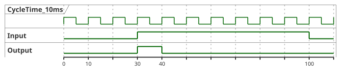
    <figcaption>R_TRIG Trigger on rising edge</figcaption>
</figure>
</div>

> This is a typical example of a functional block, because, compared to a `FC` function which has no internal memory, `R_TRIG` has to remember the previous state.

### Function block parameters `R_TRIG`
|Parameters|Declaration|Data type|Description|
|----------|-----------|---------|-----------|
|CLK       |Input      |BOOL     |Incoming signal, the edge of which is to be queried|
|Q         |Output     |BOOL     |Result of edge evaluation|

<div align="center">
<figure>
    
    <figcaption>R_TRIG: Source: <a href="https://infosys.beckhoff.com/english.php?content=../content/1033/tcplclib_tc2_standard/74391563.html&id=2005587076592354672">Beckhoff R_TRIG</a>
    </figcaption>
</figure>
</div>

### Implementation of `R_TRIG`

```iecst
FUNCTION_BLOCK R_TRIG
VAR_INPUT
    CLK    : BOOL; (* Signal to detect *)
END_VAR
VAR_OUTPUT
    Q      : BOOL; (* Edge detected *)
END_VAR
VAR
    memory : BOOL; (* Store last state*)
END_VAR

(*
   Example of implementation
*)
IF CLK        AND 
   NOT memory THEN
    Q := TRUE;
ELSE
    Q := FALSE;
END_IF
memory := CLK;
```
### Declaration and use of `R_TRIG`

```iecst
PROGRAM PRG_TRIG
VAR
    bSwitchOne : BOOL;
    rTRIG      : R_TRIG;
    iCounter   : INT;
END_VAR

(*
   Count the number of times the switch is activated.
*)
rTRIG(CLK := bSwitch);
IF rTRIG.Q THEN
   iCounter := iCounter + 1;
END_IF
```
> Since the program is cyclic, we must detect the activation edges of `bSwitch`, otherwise the counter would be incremented at each cycle when `bSwitch` is `TRUE`.

### `F_TRIG`
`F_TRIG` is the equivalent of `R_TRIG`, but on the falling edge. For example, when you release pressure on a button. Dead man's safety handles.

## Function Block `TON`, `TOF` et `TP`

<div align="center">
<figure>
    
    <figcaption>TON: Source: <a href="https://infosys.beckhoff.com/english.php?content=../content/1033/tcplclib_tc2_standard/74403595.html&id=">Beckhoff TON</a>
    </figcaption>
</figure>
</div>

<div align="center">
<figure>
    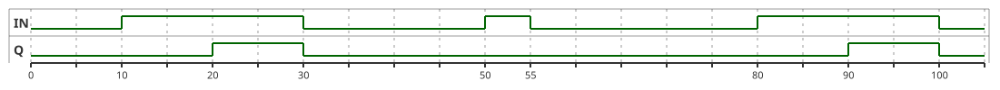
    <figcaption>TON</figcaption>
</figure>
</div>

The `Q` output activates `PT`, Pulse Duration after the `IN` variable is activated. When the `IN` input returns to `FALSE`, the `Q` output returns to `FALSE`.

The ET, Ellapsed Time variable is not plotted on the graph because the PUML tool used does not allow for proper plotting across the entire range.

Here is an excerpt below.

<div align="center">
<figure>
    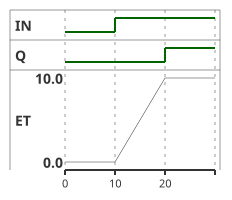
    <figcaption>TON Time Diagram Elapsed Time</figcaption>
</figure>
</div>

### Functional block settings `TON`
|Parameters|Declaration|Data type|Description|
|----------|-----------|---------|-----------|
|IN       |Input      |BOOL     |starts timer with rising edge, resets timer with falling edge|
|PT       |Input      |BOOL     |time to pass, before Q is set|
|Q        |Output     |BOOL     |is TRUE, PT seconds after IN had a rising edge|
|PT       |Output     |BOOL     |elapsed time|

### Example of code
```iecst
PROGRAM PLC_PRG
VAR
    xSwitchOpen     : BOOL;
    tonWaitOneSec   : TON;
    xActivateDoor   : BOOL;
END_VAR

tonWaitOneSec(IN := switchOpen,
              PT := T#1S,
              Q => activateDoor);
```
An `xActivateDoor` command is only activated if the operator presses `xSwitchOpen` for at least one second. *Note the special format of the time value*. `T#1000ms` could also be used.

### TOF
Unlike TON, TOF begins incrementing ET Ellapsed Time when the input signal changes from TRUE to FALSE.

<div align="center">
<figure>
    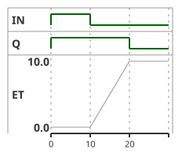
    <figcaption>TOF Time Diagram Elapsed Time</figcaption>
</figure>
</div>

### ``TP``
TP is a pulse generator, no matter how long the input signal is, the output signal will be the same.

<div align="center">
<figure>
    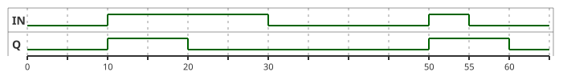
    <figcaption>TP Time Diagram</figcaption>
</figure>
</div>

---

# Last thing to know:

## Object-Oriented Programming with Function Blocks
In this chapter, we used a timer element, which in IEC 61131-3 is actually a class with a cyclic method. While this introduction will simply present the cyclical nature of the PLC language, it should also be remembered that IEC 61131-3 is also an object-oriented language well-suited to a highly structured approach involving the description of an installation in the form of a class diagram, followed by a P&ID diagram.

<div align="center">
<figure>
  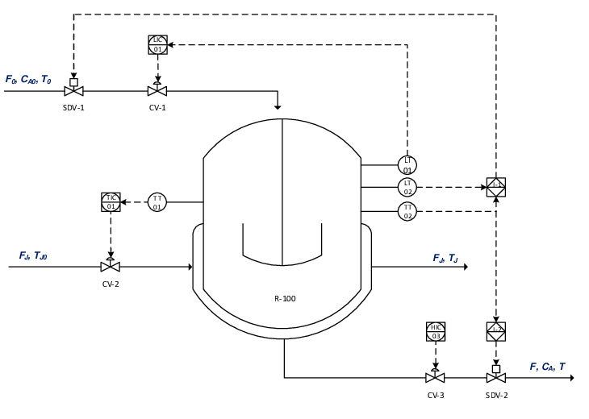
  <figcaption>Reactor Piping and Instrumentation Diagram (P&ID). Souerce: <a href="https://www.researchgate.net/publication/341816619_Cyber_LOPA_An_Integrated_Approach_for_the_Design_of_Dependable_and_Secure_Cyber_Physical_Systems">ResearchGate</a></figcaption>
</figure>
</div>

The timer used in the lab could also later be an object from a sensor library, allowing rapid prototyping of a new installation.

Below is a UML class diagram illustrating object-oriented concepts in IEC 61131-3 using Mermaid. Here, `GasSensor` inherits from `Sensor` and implements the `I_SelectGasComposition` interface. The `Bioreactor` class is composed of a `TemperatureSensor`, **TE-1** and a `GasSensor` **XE-2**.

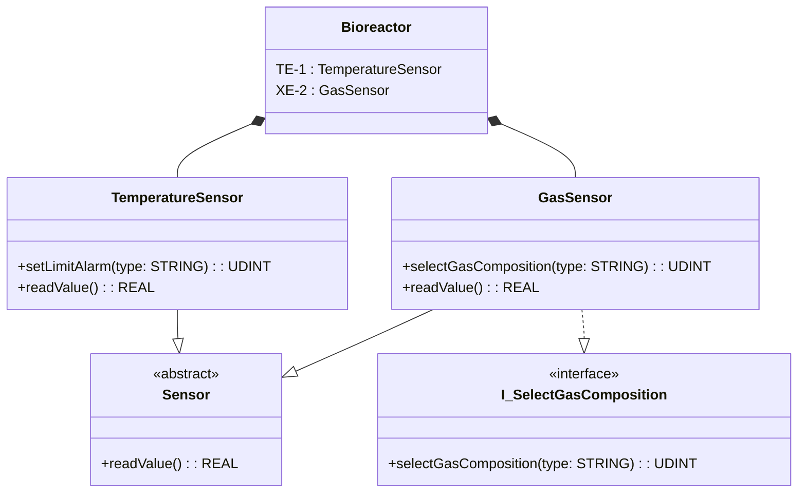

---

# Exercise
A dead man's handle is a safety module that contains a switch that is only active when it is pressed halfway. If the switch is pressed all the way down, which could cause the operator's hand to tense up, an emergency stop is activated.

<div align="center">
<figure>
    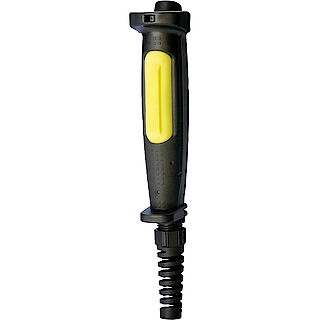
        <figcaption>Dead Man Switch, <a href="https://products.schmersal.com">Image Schmersal</a>
    </figcaption>
</figure>
</div>

```iecst
VAR_INPUT
    xSignalOneMiddle     : BOOL;
    xSignalTwoMiddle     : BOOL;
END_VAR

VAR_OUTPUT
    xEnableMove          : BOOL;
    xSendStop            : BOOL;
    xSecurityError       : BOOL;
END_VAR
```

[Solution exercise](#solution-exercise)

### URS, User Request Specification
- At the precise moment when both inputs leave the `TRUE` position, the `xSendStop` command is activated for a single program cycle.
- If both input signals are `TRUE`, the `xEnableMove` output is active.
- To prevent tampering with the security system, a timer checks that the two signals are not different for a period longer than 250 ms, *discrepancy time*. If this time limit is exceeded, `xEnableMove` is not allowed, and the `xSecurityError` signal is activated *and remains activated permanently*.
- *It is necessary to add some variables, timers, or triggers.*

## Solution Exercise
Note the formatting and alignments that make it easier to read.
> Formatting is part of code quality!

```iecst
// Header
FUNCTION_BLOCK FB_DeadManSwitch
VAR_INPUT
    xSignalOneMiddle    : BOOL;
    xSignalTwoMiddle    : BOOL;
END_VAR

VAR_OUTPUT
    xEnableMove         : BOOL;
    xSendStop           : BOOL;
    xSecurityError      : BOOL;
END_VAR
VAR
    tonDiscrepancyTime  : TON;
    fTrigStop           : F_TRIG;
    xTestSendStop       : UDINT;
END_VAR

// Code
tonDiscrepancyTime(IN := xSignalOneMiddle <> xSignalTwoMiddle,
                   PT := T#250MS);
                   
fTrigStop(CLK := xSignalOneMiddle AND
                 xSignalTwoMiddle);                  
                   
IF tonDiscrepancyTime.Q THEN
    xSecurityError := TRUE;
END_IF

IF xSignalOneMiddle          AND
   xSignalTwoMiddle          AND
   xSecurityError            THEN
   xEnableMove := TRUE;
ELSE
   xEnableMove := FALSE;
END_IF

xSendStop := fTrigStop.Q;

(*
    To check sendStop Activated
    Because it is difficult to view the value of xSendStop for one cycle,
    it could be a good idea to use a check sequence to validate it.
    This is optional
*)
IF xSendStop THEN
    xTestSendStop := xTestSendStop + 1;
END_IF
```

Alternatively, `xEnableMove` could also be coded as follows:

```iecst
xEnableMove := xSignalOneMiddle AND
               xSignalTwoMiddle AND
               NOT xSecurityError;
```


<!-- End of README.md -->
