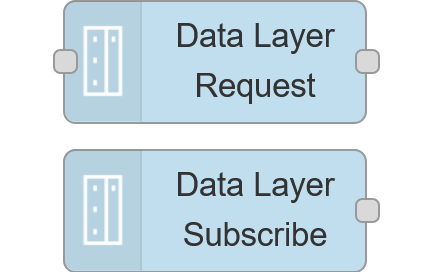
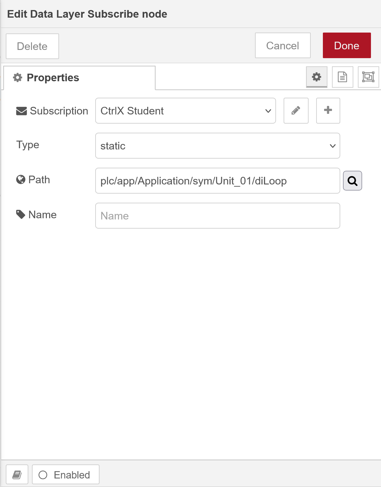
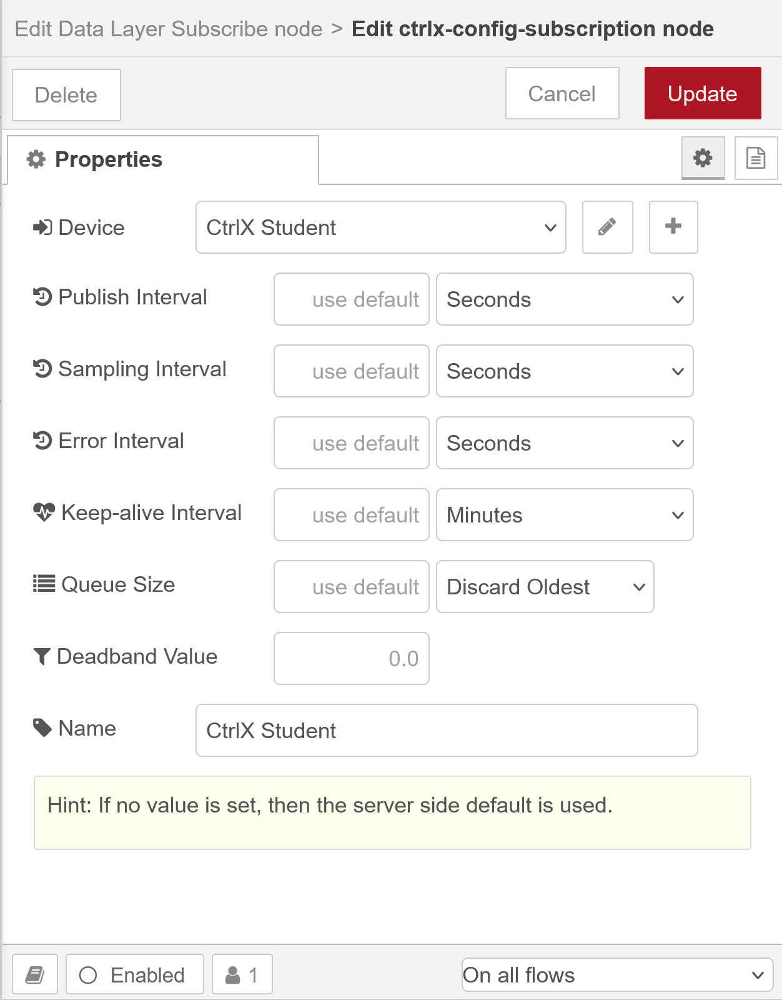
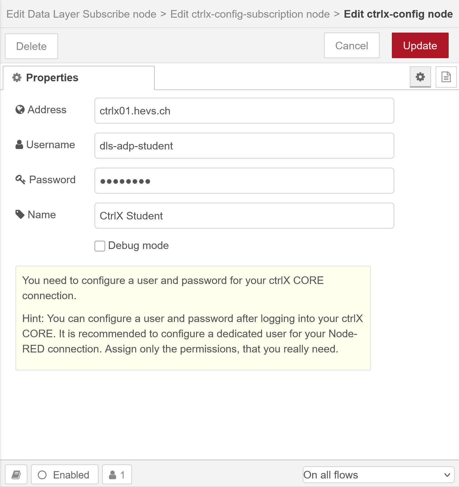
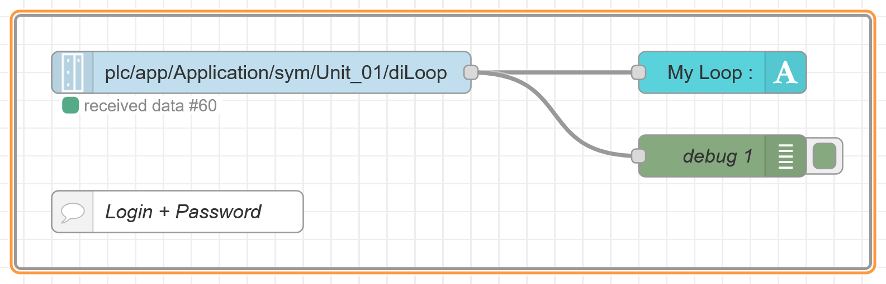

<h1>
  
    Node-RED flows
    <h2>Flow Based Programming</h2>
   
</h1>

Author: [Cédric Lenoir](mailto:cedric.lenoir@hevs.ch)

# Some exercises for Module 04

## Connect with the conveyor
Open a dos command (or OSx terminal) and ping to **ctrlx01.hevs.ch**.
Use [ctrlx01.hevs.ch](https://ctrlx01.hevs.ch) on your browser to connect to the CtrlX Core of the lab.
- **Username**: dls-adp-student
- **Password**: D1s#Adp#Student

### Base flow.json
Use the flow.json on your local git repositoy to start node-red.
    
``{your_local_repo}\adp-docs\ADP_Module_04_User_Interface\node_flows``

## How to access to CtrlX

We use a CtrlX Automation Palette.
- Details is the subject of the next module. But we need it to connect to a real machine.
- We use to kind of connection.
  - A subscription, data sent automatically from the server, the CtrlX, when the data change on the server side. The access time interval is limited and can be configured. **We will use it to read data**.
  - A node to read or write, or more, the connection is triggered by the client. **We will use it to write data**.
- You need to install the palette to use it: ``node-red-contrib-ctrlx-automation``.

<figure>
    
  <figcaption>Access to CtrlX Data Layer</figcaption>
</figure>

### Subscribe to data

On first access, you need to configure the subscription to allow to browse thru the data layer.
Click on the pen on the right of Subscription.

<figure>
    
  <figcaption>Edit Data Layer Subscribe node</figcaption>
</figure>

Then you need to edit the device accessm click on the pen on the right of Device

<figure>
    
  <figcaption>Edit Data Layer Subscribe node, device</figcaption>
</figure>

Here you can configure, Address, Username and Password, see : [Connect with the conveyor](#connect-with-the-conveyor).

<figure>
    
  <figcaption>Edit Data Layer Subscribe node, login</figcaption>
</figure>

---

We will start with the virtual conveyor.

When ready with the virtual conveyor, you will be ready to start with the robot.

## Button & Event
    1.  Insert a button with name: My first event.
    2.  Add an event.
    3.  Goal: when you press the button, you trig an event in the top left of Node-RED Dashboard.

## Text Input, default and debug.
    1. Use Insert button to init a text in Text Input.
    2. Press the button to send a message...

---

## Liste d'exercices sur le convoyeur.

### Connect to CtrlX Core

<figure>
    
  <figcaption>Access to Unit Loop</figcaption>
</figure>

### Afficher Date et heure en String

### Afficher les Led 01 à 03

### Afficher une gauge avec position moteur

### Afficher un tableau de LREAL Status Param

### Afficher une gauge de type « Tank Level » pilotée par un slide de 0 à 100%

### Afficher un tableau de LREAL command Param + un tableau qui permette de modifier un paramètre.

### Afficher un tableau Markdown et y insérer les graphiques suivants
-	Flow Diagram
-	State Diagram
-	Class Diagram

### Afficher un sélecteur Auto/Manul
