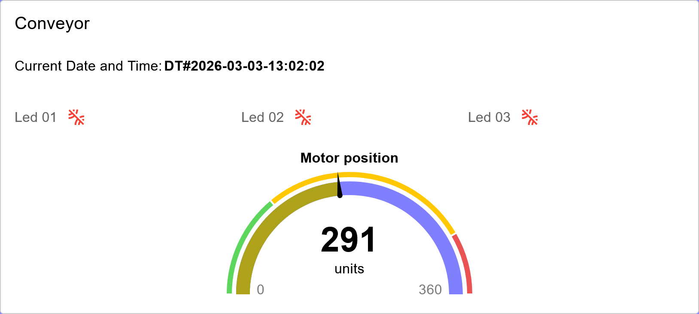
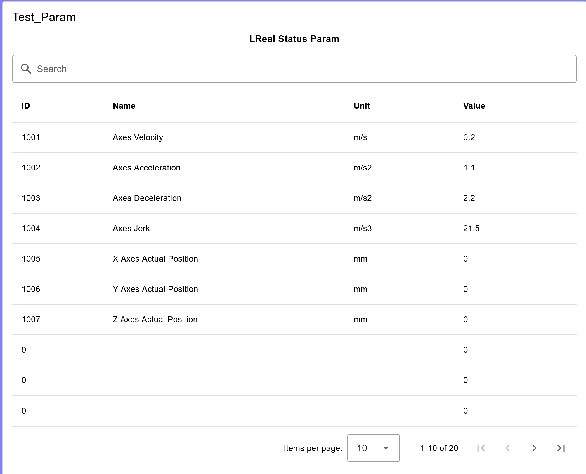
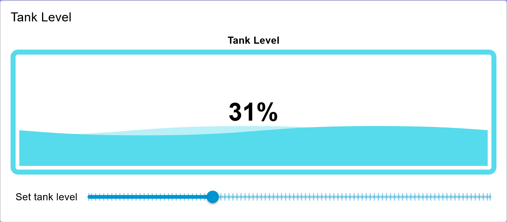
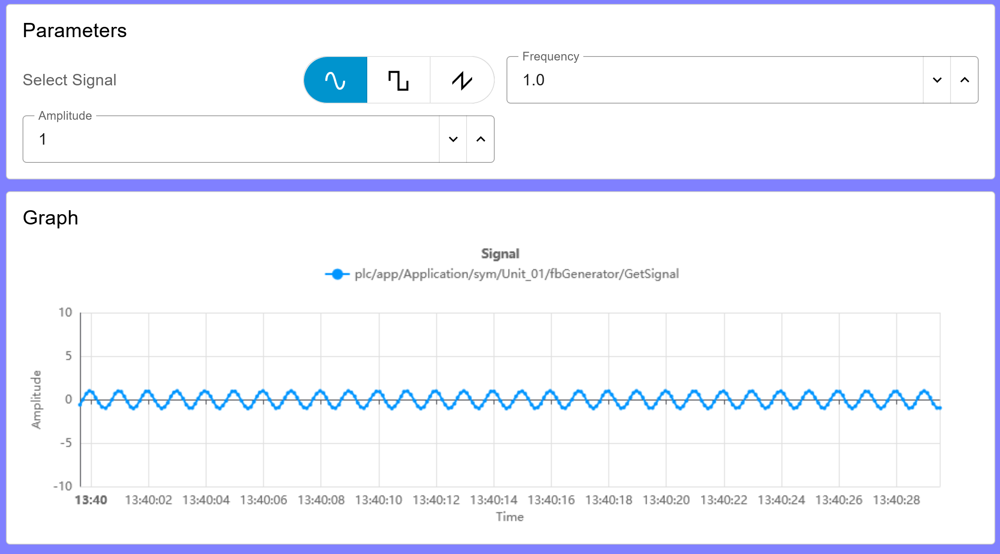
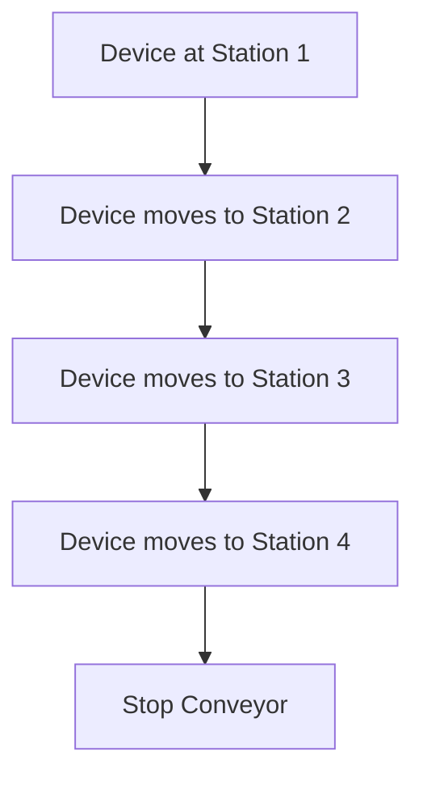
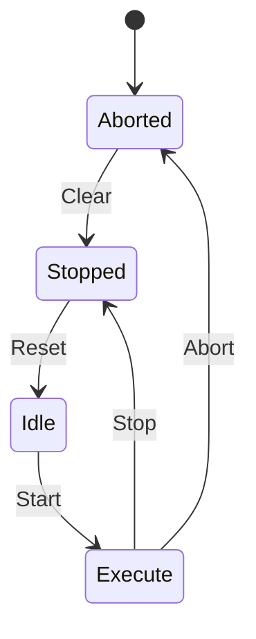

<h1>
  
  <br> Node-RED flows
    <h2>Flow Based Programming</h2>
  <br>
</h1>

Author: [Cédric Lenoir](mailto:cedric.lenoir@hevs.ch)

# Some exercises for Module 04

## Connect with the conveyor
Open a dos command (or OSx terminal) and ping to **ctrlx01.hevs.ch**.
Use [ctrlx01.hevs.ch](https://ctrlx01.hevs.ch) on your browser to connect to the CtrlX Core of the lab.
- **Username**: dls-adp-student
- **Password**: D1s#Adp#Student

### Base flow.json
Use the flow.json from your local git repositoy to start node-red.
    
``{your_local_repo}\adp-docs\ADP_Module_04_User_Interface\node_flows``

## How to access to CtrlX

We use a CtrlX Automation Palette.
- **Details is the subject of the next module**. But we need it to connect to a real machine.
- We use two types of connection.
  - A **subscription**, data are sent automatically from the server, the CtrlX, when the data change on the server side. The access time interval is limited and can be configured. **We will use subscription to read data**.
  - A node to read or write, or more, the connection is triggered by the client. **We will use it to write data**.
- You need to install the palette to use it: ``node-red-contrib-ctrlx-automation``.

<div align="center">
<figure>
    
  <figcaption>Access to CtrlX Data Layer</figcaption>
</figure>
</div>

### Subscribe to data

Upon first connection, you need to configure the subscription to allow browsing in the data layer. The data layer is a data structure in the CtrlX.
:bulb:Click on the pen on the right of Subscription.

<div align="center">
<figure>
    
  <figcaption>Edit Data Layer Subscribe node</figcaption>
</figure>
</div>

Then you need to edit the device access click on the pen on the right of Device.

:bulb: on the window bellow, it is possible to configure publish, sampling and other intervals. We keep default values.

<div align="center">
<figure>
    
  <figcaption>Edit Data Layer Subscribe node, device</figcaption>
</figure>
</div>

Here you can configure, Address, Username and Password, see : [Connect with the conveyor](#connect-with-the-conveyor).

:bulb: the flie flows.json does not store the data for Username and Password. This is for security reasons. You will need to re-enter your username and password when opening a connection.

<div align="center">
<figure>
    
  <figcaption>Edit Data Layer Subscribe node, login</figcaption>
</figure>
</div>

---

## The virtual conveyor.

When ready with the virtual conveyor, you will be ready to start with the robot.

## Button & Event
  1.  Insert a button with name: My first event.
  2.  Add an event.
  3.  Goal: when you press the button, you trig an event in the top left of Node-RED Dashboard.

## Text Input, default and debug.
  1. Use an Insert node to init a text in Text Input.
  2. Press the button to send a message...

---

## Liste d'exercices sur le convoyeur.
Il y a 10 unité, en choisir 1, si possible différente de celle de vos collègues.


### Connect to CtrlX Core

<div align="center">
<figure>
    
  <figcaption>Access to Unit Loop</figcaption>
</figure>
</div>

---

### Sensors of a conveyor

1.  Display Date and Time in String
2.  Display LEDs 01 to 03
3.  Display a Gauge with Engine Position

Access to tags, **change unit number to yours**.

```js
plc/app/Application/sym/Unit_01/emDrive/ioDrive/diMotorPosition
plc/app/Application/sym/Unit_01/stPackStatusDintParam/1/Value
plc/app/Application/sym/Unit_01/stPackStatusDintParam/2/Value
plc/app/Application/sym/Unit_01/stPackStatusDintParam/3/Value
```

Build an UI like this one

<div align="center">
<figure>
    
  <figcaption>Sensors of conveyor</figcaption>
</figure>
</div>

You could have to get a BOOL from a DINT, using a function with this code:

```js
if (msg.payload < 0.5) {
    msg.payload = false;
} else {
    msg.payload = true;
}
return msg;
```

---

### Displaying a DINT Status Param array

From this tag, **change unit number to yours**.

```
plc/app/Application/sym/Unit_01/stPackStatusDintParam
```

Build this UI.

<div align="center">
<figure>
    
  <figcaption>Array of DINT parameters</figcaption>
</figure>
</div>

### Tank level
Display a "Tank Level" type gauge controlled by a slide from 0 to 100%

Build this UI. Not linked with the PLC

<div align="center">
<figure>
    
  <figcaption>Tank level</figcaption>
</figure>
</div>

### DINTcommand Param
+ an array that allows a parameter to be modified.
:no_bell: skip this exercise.

### Markdown
Display a Markdown table and insert the following graphs. There are examples of mermaid tables below.

-	[Flow Diagram](#flow-diagram)
-	[State Diagram](#state-diagram)
-	[Class Diagram](#class-diagram)


### Write parameters for a signal generator.

With these signals **adapt unit number to yours**:
```js
plc/app/Application/sym/Unit_01/fbGenerator/SetFrequency
plc/app/Application/sym/Unit_01/fbGenerator/SetAmplitude
plc/app/Application/sym/Unit_01/fbGenerator/GetSignal
```


The code to insert in a flow [to select the type of signal](#code-to-select-type-pf-signal) is given below. *Because it uses a method and we will speak about methods later in this course*.

Build the UI for a signal generator like this one.

<div align="center">
<figure>
    
  <figcaption>Signal generator</figcaption>
</figure>
</div>

---

# Annexe

We use Mermaid diagrams because their script format is recognized by Markdown files, they can be used to document any software on GitHub and can be displayed in Node-RED with a Markdown node.

---

## Flow diagram 

Activity diagrams are used to describe how the program works, without formal rules. They allow us to communicate the general operation of the software without going into implementation details.

For more details: [Flowcharts - Basic Syntax](https://mermaid.ai/open-source/syntax/flowchart.html)


<div align="center">



</div>

---

## State diagram
Unlike the flowchart mentioned above, the state diagram is much more precise. The states and transition conditions shown in the diagram often correspond exactly to what is found in the program. Furthermore, an AI can generate code very efficiently from a state diagram. 

:bulb:Widely used in IEC 61131-3 programming to represent program behavior.

<div align="center">


</div>

---

## Class diagram
While a state diagram represents a program's behavior, a class diagram represents its structure. A class diagram corresponds to precise and standardized code. It is essential for working efficiently in object-oriented programming. One can simply represent the classes and their inheritance, or delve into the details and scope of variables.

:bulb:Widely used in IEC 61131-3 programming to represent program structure.


---

## Arguments for methods

### One bool argument
Here, there is one argument with name: **Enable**.

```js
var newMsg = {};
newMsg.payload = {
    type: "object",
    value: {
        "Enable": msg.payload
    }
}
return newMsg;
```

### Two arguments

```js
var newMsg = {};

flow.get('rLimitOpen_mm')

newMsg.payload = {
    type: "object",
    value: {
        "rLimitOpen_mm": flow.get('rLimitOpen_mm'),
        "udiTimeOut_ms":flow.get('udiTimeOut_ms')
    }
}
return newMsg;
```

---

## Data Layer Data Types

The following table shows the data types of the ctrlX Data Layer and the mapping to Node-RED (javascript) as well as to the types of the IEC61131-3 programming language of the PLC app.

| Data Layer | Javascript | IEC61131-3 |
| --- | --- | --- |
| `bool8`     | `boolean`                      | `BOOLEAN`, `BIT`  |
| `int8`      | `number`                       | `SINT`            |
| `uint8`     | `number`                       | `USINT`, `BYTE`   |
| `int16`     | `number`                       | `INT`             |
| `uint16`    | `number`                       | `UINT`, `WORD`    |
| `int32`     | `number`                       | `DINT`            |
| `uint32`    | `number`                       | `UDINT`, `DWORD`  |
| `int64`     | `BigInt`                       | `LINT`            |
| `uint64`    | `BigInt`                       | `ULINT`, `LWORD`  |
| `float`     | `number`                       | `REAL`            |
| `double`    | `number`                       | `LREAL`           |
| `string`    | `String`                       | `STRING`          |
| `arbool8`   | `object` (`Array` of `number`) | `ARRAY OF BOOLEAN`, `ARRAY OF BIT` |
| `arint8`    | `object` (`Array` of `number`) | `ARRAY OF SINT`                    |
| `aruint8`   | `object` (`Array` of `number`) | `ARRAY OF USINT`, `ARRAY OF BYTE`  |
| `arint16`   | `object` (`Array` of `number`) | `ARRAY OF INT`                     |
| `aruint16`  | `object` (`Array` of `number`) | `ARRAY OF UINT`, `ARRAY OF WORD`   |
| `arint32`   | `object` (`Array` of `number`) | `ARRAY OF DINT`                    |
| `aruint32`  | `object` (`Array` of `number`) | `ARRAY OF UDINT`, `ARRAY OF DWORD` |
| `arint64`   | `object` (`Array` of `BigInt`) | `ARRAY OF LINT`                    |
| `aruint64`  | `object` (`Array` of `BigInt`) | `ARRAY OF ULINT`, `ARRAY OF LWORD` |
| `arfloat`   | `object` (`Array` of `number`) | `ARRAY OF REAL`                    |
| `ardouble`  | `object` (`Array` of `number`) | `ARRAY OF LREAL`                   |
| `arstring`  | `object` (`Array` of `string`) | `ARRAY OF STRING`                  |
| `object`    | `object`                       | via library |

The first column is the datatype which is used for the attribute `type` in the `msg.payload` when reading or writing Data Layer Requests with the property of the payload format set to `value + type (json)`.

For example, a `READ` request to the path `framework/metrics/system/cpu-utilisation-percent` might return the following json in `msg.payload`:

  ```JSON
  {
    "value": 17.5,
    "type": "double"
  }
  ```

---

## Code To select type pf signal

You have to import this code in a flow to select the signal

```js
[
    {
        "id": "084d3dc2dd3b6ed7",
        "type": "group",
        "z": "d68cdb0fd9abf016",
        "style": {
            "stroke": "#999999",
            "stroke-opacity": "1",
            "fill": "none",
            "fill-opacity": "1",
            "label": true,
            "label-position": "nw",
            "color": "#a4a4a4"
        },
        "nodes": [
            "e02efbbb84e8af15",
            "db51d4ad6a7305e6",
            "146b94c33535290f",
            "210619fba6998671"
        ],
        "x": 34,
        "y": 519,
        "w": 1032,
        "h": 222
    },
    {
        "id": "e02efbbb84e8af15",
        "type": "function",
        "z": "d68cdb0fd9abf016",
        "g": "084d3dc2dd3b6ed7",
        "name": "Set Signal Type",
        "func": "var newMsg = {};\nnewMsg.payload = {\n    type: \"object\",\n    value: {\n        \"eSignalType\": msg.payload\n    }\n}\nreturn newMsg;",
        "outputs": 1,
        "timeout": 0,
        "noerr": 0,
        "initialize": "",
        "finalize": "",
        "libs": [],
        "x": 380,
        "y": 560,
        "wires": [
            [
                "210619fba6998671",
                "db51d4ad6a7305e6"
            ]
        ]
    },
    {
        "id": "db51d4ad6a7305e6",
        "type": "ctrlx-datalayer-request",
        "z": "d68cdb0fd9abf016",
        "g": "084d3dc2dd3b6ed7",
        "device": "75a855caee6b9b3a",
        "method": "READ_WITH_ARG",
        "path": "plc/app/Application/sym/Unit_01/fbGenerator/mSetForm",
        "payloadFormat": "value_type",
        "name": "",
        "pendingWarnLevel": 50,
        "pendingErrorLevel": 100,
        "x": 790,
        "y": 560,
        "wires": [
            []
        ]
    },
    {
        "id": "146b94c33535290f",
        "type": "ui-button-group",
        "z": "d68cdb0fd9abf016",
        "g": "084d3dc2dd3b6ed7",
        "name": "",
        "group": "e917e98ef425a8d5",
        "order": 1,
        "width": 6,
        "height": 1,
        "label": "Select Signal",
        "className": "",
        "rounded": true,
        "useThemeColors": true,
        "passthru": false,
        "options": [
            {
                "label": "",
                "icon": "sine-wave",
                "value": "10",
                "valueType": "num",
                "color": "#009933"
            },
            {
                "label": "",
                "icon": "square-wave",
                "value": "20",
                "valueType": "num",
                "color": "#999999"
            },
            {
                "label": "",
                "icon": "sawtooth-wave",
                "value": "30",
                "valueType": "num",
                "color": "#ff6666"
            }
        ],
        "topic": "topic",
        "topicType": "msg",
        "x": 130,
        "y": 560,
        "wires": [
            [
                "e02efbbb84e8af15"
            ]
        ]
    },
    {
        "id": "210619fba6998671",
        "type": "debug",
        "z": "d68cdb0fd9abf016",
        "g": "084d3dc2dd3b6ed7",
        "name": "Function",
        "active": false,
        "tosidebar": true,
        "console": false,
        "tostatus": false,
        "complete": "payload",
        "targetType": "msg",
        "statusVal": "",
        "statusType": "auto",
        "x": 640,
        "y": 700,
        "wires": []
    },
    {
        "id": "75a855caee6b9b3a",
        "type": "ctrlx-config",
        "name": "CtrlX_Wifi",
        "hostname": "192.168.1.111",
        "debug": false
    },
    {
        "id": "e917e98ef425a8d5",
        "type": "ui-group",
        "name": "Parameters",
        "page": "cbc2f641b0d8bbf9",
        "width": 6,
        "height": 1,
        "order": 1,
        "showTitle": true,
        "className": "",
        "visible": "true",
        "disabled": "false",
        "groupType": "default"
    },
    {
        "id": "cbc2f641b0d8bbf9",
        "type": "ui-page",
        "name": "Generator",
        "ui": "926d3079c9560d19",
        "path": "/generator",
        "icon": "sine-wave",
        "layout": "notebook",
        "theme": "8966a7b403a8fb88",
        "breakpoints": [
            {
                "name": "Default",
                "px": "0",
                "cols": "3"
            },
            {
                "name": "Tablet",
                "px": "576",
                "cols": "6"
            },
            {
                "name": "Small Desktop",
                "px": "768",
                "cols": "9"
            },
            {
                "name": "Desktop",
                "px": "1024",
                "cols": "12"
            }
        ],
        "order": 6,
        "className": "",
        "visible": "true",
        "disabled": "false"
    },
    {
        "id": "926d3079c9560d19",
        "type": "ui-base",
        "name": "Home",
        "path": "/dashboard",
        "appIcon": "factory",
        "includeClientData": true,
        "acceptsClientConfig": [
            "ui-notification",
            "ui-control"
        ],
        "showPathInSidebar": false,
        "navigationStyle": "fixed",
        "titleBarStyle": "default",
        "showReconnectNotification": true,
        "notificationDisplayTime": "1",
        "showDisconnectNotification": true
    },
    {
        "id": "8966a7b403a8fb88",
        "type": "ui-theme",
        "name": "Default Theme",
        "colors": {
            "surface": "#ffffff",
            "primary": "#0094ce",
            "bgPage": "#8080ff",
            "groupBg": "#ffffff",
            "groupOutline": "#cccccc"
        },
        "sizes": {
            "density": "default",
            "pagePadding": "12px",
            "groupGap": "12px",
            "groupBorderRadius": "4px",
            "widgetGap": "12px"
        }
    }
]
```