<h1>
  
  <br> Automation in devopment and production
    <h2>Interfaces</h2>
  <br>
</h1>

Author: [Cédric Lenoir](mailto:cedric.lenoir@hevs.ch)

# Module 04 Machine Interfaces

*Keywords:* **Request / Subscribe / Read / Write / Method**

<figure>
    
  <figcaption><a href="https://opcfoundation.org/">OPC-UA</a></figcaption>
</figure>

## Introduction
A machine interface implies communication between two different presentations of data. Therefore, we begin by providing an overview of a machine's data structure in various formats.

## About data structures
On problem with interfaces, is that it could have to deal with various data structures depending of implementation language.

The principle is mainly the same for all languages, here we give an example of the same structure for PLC IEC 61131-3, Javascript, Python and JSON.

### Why data structure is important
Below, we will see how to access machine data. If we simply need to work on a prototype containing a few sensors, we can consider directly accessing simple variables. We provide a slightly more complex example below to illustrate the importance of data structures.

<div align="center">
<figure>
    
  <figcaption>Drink Processing version Pipe & Process Diagram, P&ID</figcaption>
</figure>
</div>

<div align="center">
<figure>
    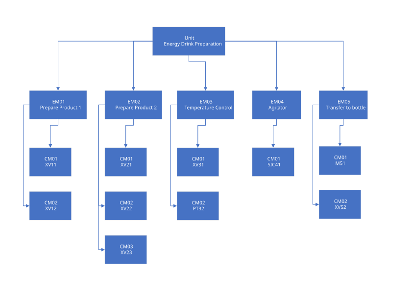
  <figcaption>Drink Processing version ISA-88</figcaption>
</figure>
</div>

<div align="center">
<figure>
    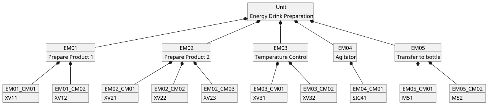
  <figcaption>Drink Processing version UML</figcaption>
</figure>
</div>

At the top, we have a unit containing several pieces of equipment, which themselves contain several Control Modules.

If we take the example of the XV11, a common flow control valve in industry, it will itself consist of numerous variables, which could include, among others:

- The setpoint flow rate.

- The controller parameters.

- The measured flow rate.

The address space could be viewed as a file tree that contains, for the XV11 valve...

C:/Unit/EM01/EM01_CM01/EM01_CM01.json

If you want to access a variable from Python or Javascript code, you will try to access a variable in the following way:

```js
ActualFlow = Unit.EM01.EM01_CM01.FlowMeterIsValue;
```

With an OPC-UA protocol we can browse thru the address space of the IACS server to find any value, for example to read from or write to.

<div align="center">
<figure>
    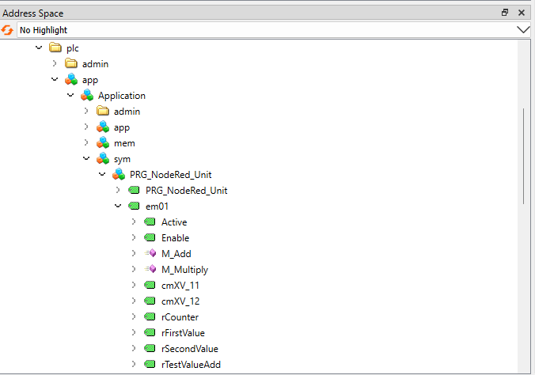
  <figcaption>Drink Processing OPC-UA Address Space example</figcaption>
</figure>
</div>

Finally, note that access rights to system variables are configured by writing the PLC/IACS programmer. That is your entry point for the communication with the automation entity. You will have rights to read or write or to invoke methods.

<div align="center">
<figure>
    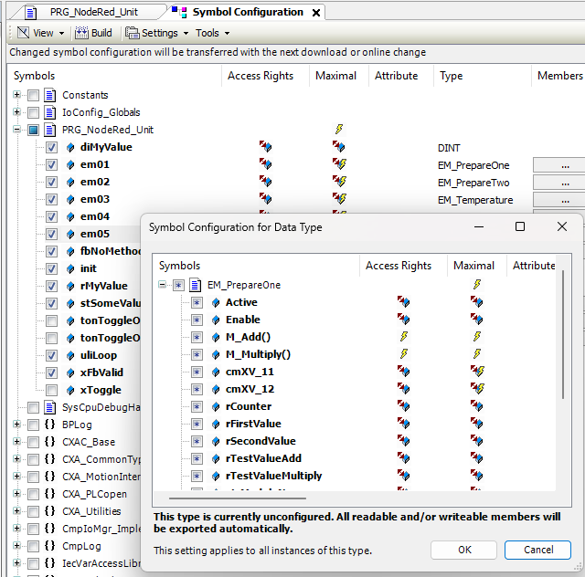
  <figcaption>The access rights for OPC-UA or DataLayer</figcaption>
</figure>
</div>

With older protocols like Modbus, each system variable was known only by its register number, making it impossible to access the system correctly without knowing the register list. With a protocol like OPC-UA, it's possible to obtain the system's directory structure without prior knowledge.

### Is a tree diagram structure the best solution?
Not necessarily. The PackML standard, a normalized structure for machine communication proposes a data list structure. In practice, a combination of both can be used.

The advantage of parameter lists is that they are much simpler to manage in terms of display and archiving.

For example, array of DINT and REAL parameters.

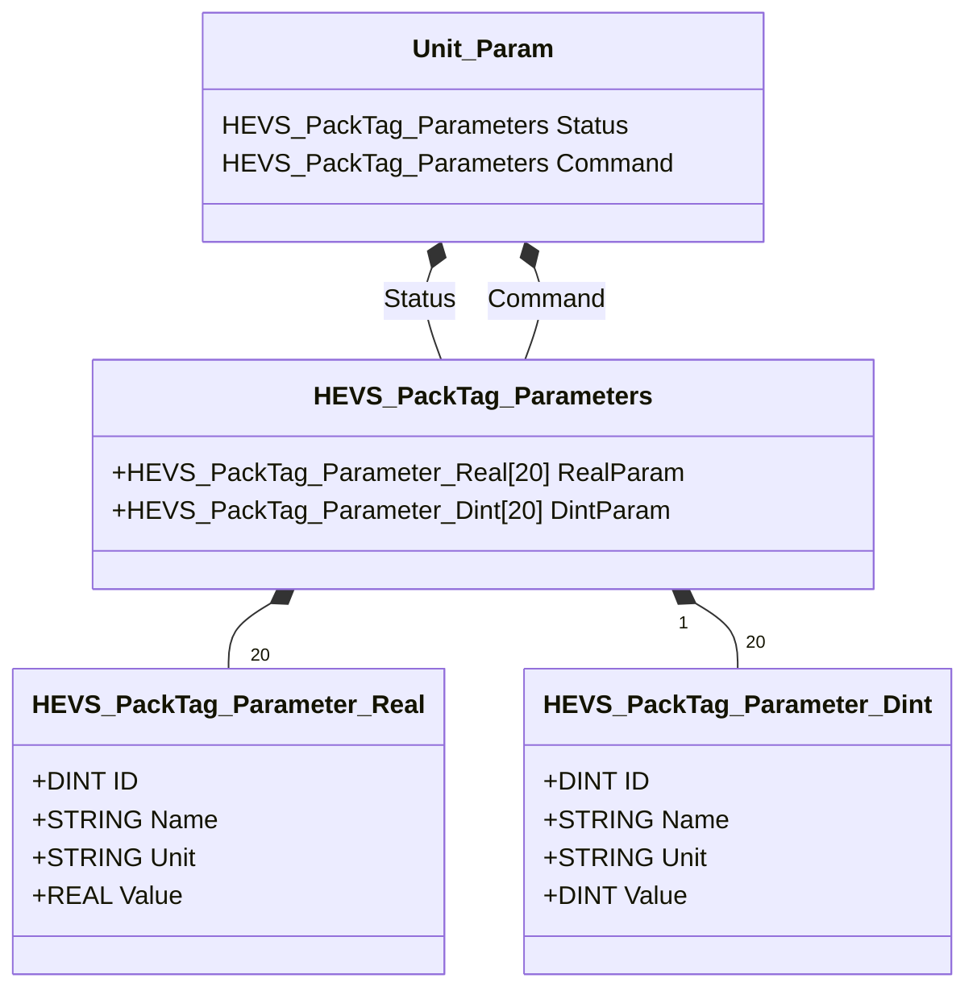

### PLC / IEC 61131-3
The IEC 61131-3 language is considered as strongly type as its ancestor, the **Pascal**. One second feature of IEC 61131-3, it is static. That is: every variable exists before the program start to run.

:warning: Variables can have different sizes, between 8 and 64 bits. For example: USINT and ULINT. Respectively 8 bits and 64 bits unsigned.

This can sometimes be a problem for people used to declaring variables **haphazardly** in Python code.

But it's **a major advantage when writing an interface**, because we know the variable exists.

```iecst
TYPE ST_SomeValues :
STRUCT
	strMyString	: STRING := 'Hello Wordl';
	rMyReal		: REAL;
	diMyDint	: DINT;
	xMyBool		: BOOL;
	arManyReals	: ARRAY[1..10] OF REAL;
END_STRUCT
END_TYPE
```

### Javascript
Here, it's exactly the opposite; we only know whether it's a number, a string, an object, or a boolean.

The numbers are all encoded using 64 bits.

```js
const ST_SomeValues = {
    strMyString: "Hello Wordl",
    rMyReal: 0.0,
    diMyDint: 0,
    xMyBool: false,
    arManyReals: new Array(10).fill(0.0)
};
```

### Python

| Type | Example | Description |
| ---------- | --------------- | ----------------------------- |
| `int` | `42`, `-7` | Integers (unlimited size) |
| `float` | `3.14`, `-0.5` | Floating-point numbers |
| `complex` | `1+2j` | Complex numbers |
| `bool` | `True`, `False` | Booleans |
| `str` | `"hello"` | Strings |
| `bytes` | `b'abc'` | Byte sequence |
| `NoneType` | `None` | Special value for "nothing" |

```python
ST_SomeValues = {
    "strMyString": "Hello Wordl",
    "rMyReal": 0.0,
    "diMyDint": 0,
    "xMyBool": False,
    "arManyReals": [0.0] * 10
}
```

### JSON
It is not strictly speaking a language, however, data in JSON format is used to format messages in Node-RED.

```json
{
    "strMyString": "Hello Wordl",
    "rMyReal": 0.0,
    "diMyDint": 0,
    "xMyBool": false,
    "arManyReals": [0.0, 0.0, 0.0, 0.0, 0.0, 0.0, 0.0, 0.0, 0.0, 0.0]
}
```

While JSON is naturally supported by Javascript, JSON can also be used with Python.

```python
import json

# Creating a dictionary
dictionary = {1: 'Sensor', 2: 'Structure', 3: 'Node-RED', 4: 'Interface'}

# Convert the dictionary to a JSON string
json_s = json.dumps(dictionary)
print(json_s)
print(type(json_s))
```

### About various languages
This overview is intended to make you aware of one thing: you cannot transfer just any value to or from any machine.

At best, there may be data loss; at worst, the machine receiving the incorrect information will crash.

### Protocole
There exist an industrial standard with name OPC-UA. There exist many palette modules for OPC-UA, but as the palette for CtrlX Code propose more or less the same functionalities and is more easy to use, we will use [node-red-contrib-ctrlx-automation](https://flows.nodered.org/node/node-red-contrib-ctrlx-automation) palette as illustation of this kind of interface.

<figure>
    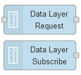
  <figcaption><a href="https://flows.nodered.org/node/node-red-contrib-ctrlx-automation">ctrlX Automation</a></figcaption>
</figure>

---

# Machine Interface
In the first part of this module, we discussed the user interface (UI) between Node-RED and the user. This is also often referred to as the Human-Machine Interface (HMI). Therefore, it is the machine-level interface that interests us here.

It would be too lengthy to discuss all the types of interfaces available for Node-RED in detail here. We will briefly describe the main ones, and then go into more detail about the one we use in the [HEVS](https://www.hevs.ch) automation lab.

## Interface jungle.
Almost every manufacturer has developed its own standard. Even though OPC UA (Open Platform Communications Unified Architecture) exists, this standard is often an additional layer grafted onto the IACS vendor's proprietary protocol, with several consequences:
- Access is slower.
- Available services vary from one platform to another.
- It is not always as polished as some of the code maintained by the vendors themselves.

### OPC UA

[OPC UA](https://opcfoundation.org/) is a cross-platform, open-source data exchange standard for industrial automation that allows different devices and systems to communicate securely and reliably. Developed by the OPC Foundation, it enables secure data transfer from the factory floor to the cloud and is a key component of Industry 4.0. Unlike older protocols, OPC UA is platform-independent, works across various operating systems like Windows, Linux, and embedded devices, and includes modern security features. 

It exist a serie de nodes pour OPC-UA. Il en existe même plusieurs et tous ne sont pas en Open Source.

### Other protocols.
Flowfuse offers a page that lists a number of so-called certified nodes.

[Certified Nodes from FlowFuse](https://flowfuse.com/certified-nodes/).

Here are a few examples.

#### S7
For Siemens S7, which remains the world leader in industrial automation, particularly with its Simatic S7 range. It's the most widespread system in Valais.

#### Mcprotocol
For Mitsubishi Electric Corporation, a market leader in Asia.

#### CIP Ethernet IP
Primarily for Allen-Bradley PLCs, a leader in the US market.

#### node-red-contrib-ads-client
This one works for Beckhoff systems, a leader in French-speaking Switzerland. It's not mentioned in the FlowFuse list, yet it's extremely stable, and we use it regularly in several HEVS projects without ever encountering a problem.

#### In summary
Node-RED nodes exist for the vast majority of IACS systems on the market.

#### The upside.

Even though the nodes are different, the operating principle is relatively similar for each vendor. So if you know how to use CtrlX nodes, you won't be lost if you need to switch to another platform, especially OPC-UA, Beckhoff, or Siemens.

---

## Client-Server Architecture
The machine acts as a server, offering various services to the client.

### Connection
Secured connection with multiple security layers.

#### Password Protection
- Username and password authentication mandatory
- Required by strict industry norms and regulations
- Essential for PLC access

#### Certificate Management
Certificate exchange process using X.509 certificates:
- Mutual authentication between client and server
- Certificate validation against trust list
- Session key negotiation
- Message signing and encryption to prevent man-in-the-middle attacks

#### Encryption
Communication encryption using Basic256Sha256 security policy:
- 256-bit symmetric encryption for confidentiality
- SHA-256 for hashing/signing and key derivation
- X.509 certificate-based mutual authentication
- Protects message exchange, integrity, and authenticity
- Improved security over Basic256 (uses SHA-256 instead of SHA-1)
- Note: Higher CPU usage, requires certificate management

#### Discovery
Feature allowing clients to browse all available server resources during communication establishment.

#### Services
Three main interaction types:
1. Read - One-time data reading
2. Write - One-time data writing
3. Subscription - Event-based updates
    - Client receives updates only when data changes
    - Efficient network usage even with numerous subscribed parameters

#### Methods
- Compatible with various languages including IEC 61131-3
- Direct invocation of PLC methods via OPC-UA
- Supports parameter passing
- Example: Gripper activation with timing and closure conditions

#### Structure
Supports direct operation on data structures/objects beyond simple value operations.

---

## Machine Interface in Practice
Regardless of the type of interface with a machine, the principle is often the same.

- Establishing the connection via Ethernet.
- Reading a variable or an object.
- Writing a variable or an object.
- Subscribing to a variable or a structure.
- Calling a method.

### Connection via Ethernet

Below, we present the principle of a Node-RED connection to an IACS via OPC-UA.

1. Establishing communication. IP address, port number.
2. Activating a session. Login, password.
3. Traversing the address space.

> The address space should be viewed as a tree diagram. [See above, data structure](#about-data-structures).

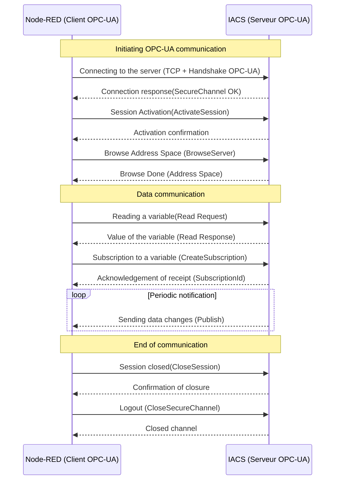

### Practical Examples
As mentioned above, we will use the DataLayer CtrlX Core protocol to illustrate this course. In terms of usage, it is very similar to OPC-UA, but while most open-source palettes in OPC-UA do not allow address space traversal, Bosch Rexroth's DataLayer version does, which considerably simplifies its use.

<figure>
    
  <figcaption><a href="https://flows.nodered.org/node/node-red-contrib-ctrlx-automation">ctrlX Automation</a></figcaption>
</figure>

#### Data Layer Read Request
Lors de la première connexion, il va falloir paramétrer cette connexion. Nous allons le faire pour lire une valeur.

<div align="center">
<figure>
    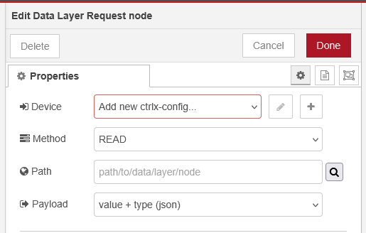
  <figcaption>Read data layer, click button <+> to add connection</figcaption>
</figure>
</div>

<div align="center">
<figure>
    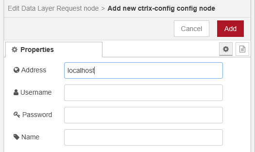
  <figcaption>Add new ctrlx-config node</figcaption>
</figure>
</div>

- Address is the IP address of the server, for example:
  - **Address**: http://10.30.4.118
  - **Username**: hevs
  - **Password**: **********
  - **Name**: Any name for the connection

If you can browse thru the address space of the data layer, it means you are successfully connected to the IACS and can select the data to read.

<div align="center">
<figure>
    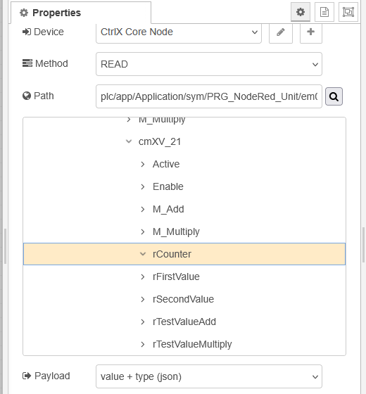
  <figcaption>CtrlX Read First Node Path</figcaption>
</figure>
</div>

After the first node connection is done, you do not nead to configure the connection again, except if you want to connect to another server. Multiple server connection is out of the scope of this cours, even if it should not be an issue.

##### About the pass

```js
plc/app/Application/sym/PRG_NodeRed_Unit/em02/cmXV_21/rCounter
```

For this example, we have build the prototype of a process unit in the IACS. You can see in the pass that it correspond to the architecture of the installation.

A counter in the valve ``xv_21`` of product preparation. A bad structured address space could be something like ``register_1021``...

<div align="center">
<figure>
    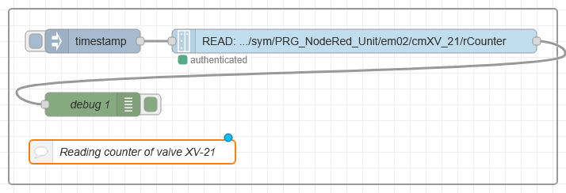
  <figcaption>CtrlX Read First Node Group</figcaption>
</figure>
</div>

Finally, by triggering the timestamp, you get in the debut window:

```js
{"type":"float","value":17940.013671875,"responseType":"read"}
```

or

```js
{
  "type":"float",
  "value":17940.013671875,
  "responseType":"read"
}
```

You can see that this is not really a variable, but an object. To extract the value of the object, you can use a change node.

<div align="center">
<figure>
    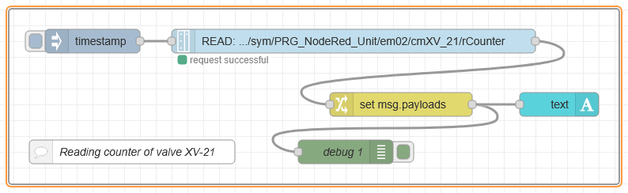
  <figcaption>CtrlX Read First Node Group Change</figcaption>
</figure>
</div>

<div align="center">
<figure>
    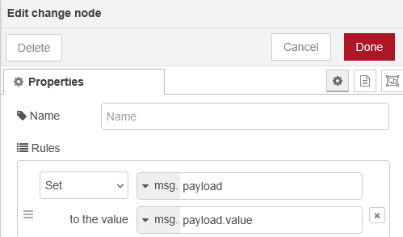
  <figcaption>CtrlX Read First Node Group Change Configure</figcaption>
</figure>
</div>

If you can read a variable, as this variable is an object, you can use the same way to read a whole object. For example the valve **XV-21 ?**. :warning: **No** !

> :bulb: you can read a structure, an array or various kind of data structure, but at this time, you cannot read XV-21 because this is a Function Block. The Function Block is an object with some code, and you can read only the variables of XV-21.


But you can read any data type which is an IEC-61131-3 ``STRUCT``.

For example, this IEC 61131-3 structure:

```ìecst
TYPE ST_SomeValues :
STRUCT
	strMyString	: STRING := 'Hello Wordl';
	rMyReal		: REAL;
	diMyDint	: DINT;
	xMyBool		: BOOL;
	arManyReals	: ARRAY[1..10] OF REAL;
END_STRUCT
END_TYPE
```

You can give the path of this object:

```json
plc/app/Application/sym/PRG_NodeRed_Unit/stSomeValues
```

A string, some variables and an array fo REAL will give in Node-RED

```json
{
  "strMyString":"Hello World",
  "rMyReal":3.14,
  "diMyDint":0,
  "xMyBool":false,
  "arManyReals":[1.1,2.2,3.3,4.4,0,0,0,0,0,0]}
```

#### Reading at time interval
It is possible to use the inject node at defined time interval.

<div align="center">
<figure>
    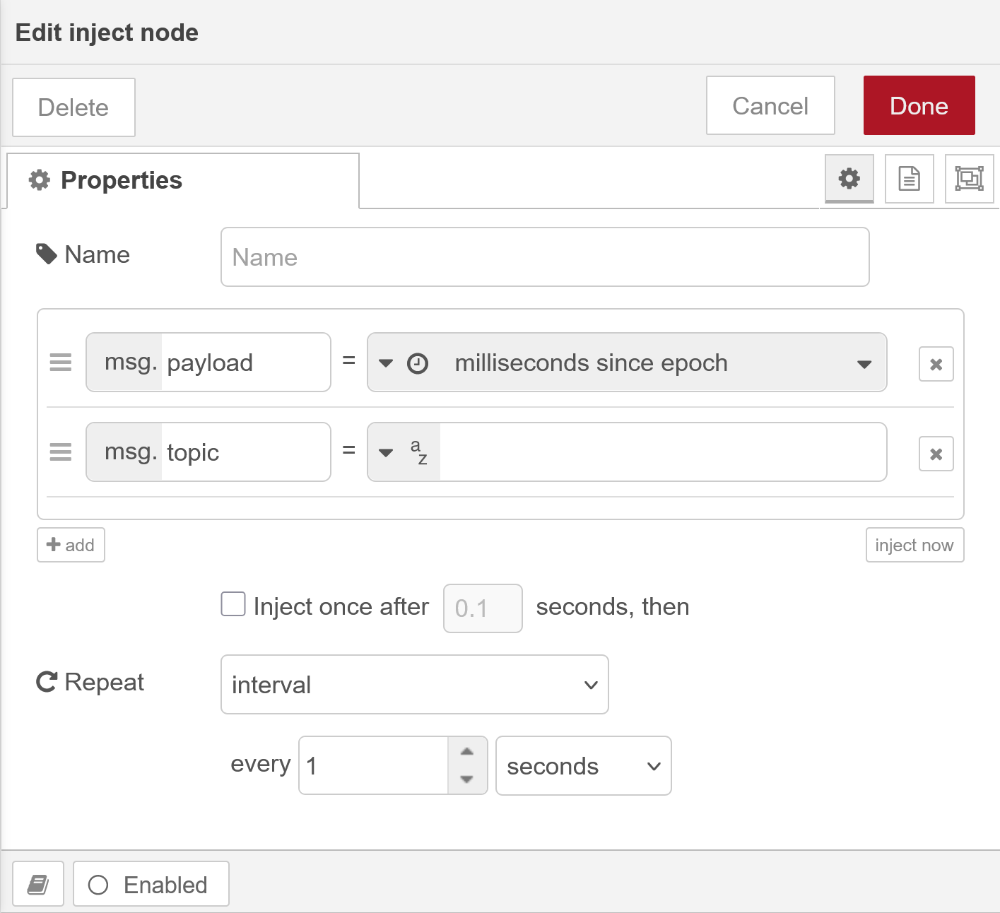
  <figcaption>CtrlX Read every 1 second</figcaption>
</figure>
</div>

##### Data Subscribe
The big advangage of Subscribe is to read data only when they are changing. For example, if you are reading a big object of 1000 parameters wich are changing seldom, You do not risk blocking your communication with a to big data flow.

<div align="center">
<figure>
    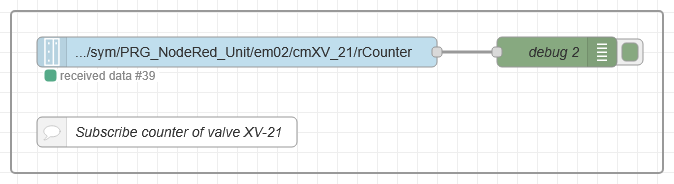
  <figcaption>Subscribe counter roup</figcaption>
</figure>
</div>

The example above read the same value as the example with Read. **But**, if the data does not change,  no data is send from the server to the client.

As for the read node, the first time **only**, you have to define a subscription.

<div align="center">
<figure>
    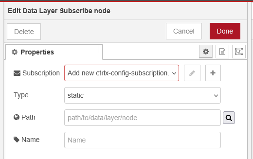
  <figcaption>Edit data layer subscribe node</figcaption>
</figure>
</div>

Even if by subscribing to a data, you want only receive modification of data, there are some limitation. For example, if you are using a PLC in an IACS with a counter running in a task a $100 [ms]$, you will quickly overload the system. That's why you can set some limitation on the subscription interval.

> :bulb: In this course, we do not go in details of the selection of intervals, we will use default values. But if you are running with a lot of values, or with a small interval, you could have to take care about it, because the combination of lot of data and small intervals could finally overload your system and lead to lost of data or even crash of your system.

> We are dealing with a real time system and the baud rate, that is

<div align="center">
<figure>
    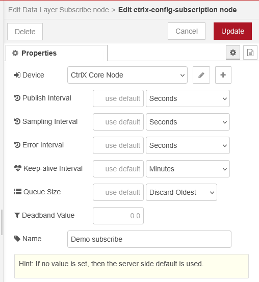
  <figcaption>Edit data layer subscribe node properties</figcaption>
</figure>
</div>

:bulb: note that data presentation of the subscribe node is a little bit different than for the read node. Here, you do no receive the whole node as payload, but only the value. The advantage, one more time, is to transfer as little data as needed.

```json
payload = 15476.97265625
```

:bulb: you can note that the subscribe node is for transmission of data from the server to the client only, Now you should have understand the difference between **Data Request** and **Data Subscribe**, we can continue with some more options givent by the Data Request Node.

#### Data Layer Write Request
The writing process is a little more complicated; we'll start by explaining why.

1.  The data format is not the same in javascript than for a PLC. If in javascript almost any numeric value is just a number coded with 64 bits, in a PLC you can have booleans, real, signed or not signed intergers in various formats from 8 to 64 bits. So, you can place any PLC numeric value in a javascript number, but the reverse is not true.
2.  With the CtrlX Data Layer, as for the OPC-UA there is an intermediate layer between Node and PLC on IACS.

##### About Data Layer, data types

The following table shows the data types of the ctrlX Data Layer and the mapping to Node-RED (javascript) as well as to the types of the IEC61131-3 programming language of the PLC app.

| Data Layer | Javascript | IEC61131-3 |
| --- | --- | --- |
| `bool8`     | `boolean`                      | `BOOLEAN`, `BIT`  |
| `int8`      | `number`                       | `SINT`            |
| `uint8`     | `number`                       | `USINT`, `BYTE`   |
| `int16`     | `number`                       | `INT`             |
| `uint16`    | `number`                       | `UINT`, `WORD`    |
| `int32`     | `number`                       | `DINT`            |
| `uint32`    | `number`                       | `UDINT`, `DWORD`  |
| `int64`     | `BigInt`                       | `LINT`            |
| `uint64`    | `BigInt`                       | `ULINT`, `LWORD`  |
| `float`     | `number`                       | `REAL`            |
| `double`    | `number`                       | `LREAL`           |
| `string`    | `String`                       | `STRING`          |
| `arbool8`   | `object` (`Array` of `number`) | `ARRAY OF BOOLEAN`, `ARRAY OF BIT` |
| `arint8`    | `object` (`Array` of `number`) | `ARRAY OF SINT`                    |
| `aruint8`   | `object` (`Array` of `number`) | `ARRAY OF USINT`, `ARRAY OF BYTE`  |
| `arint16`   | `object` (`Array` of `number`) | `ARRAY OF INT`                     |
| `aruint16`  | `object` (`Array` of `number`) | `ARRAY OF UINT`, `ARRAY OF WORD`   |
| `arint32`   | `object` (`Array` of `number`) | `ARRAY OF DINT`                    |
| `aruint32`  | `object` (`Array` of `number`) | `ARRAY OF UDINT`, `ARRAY OF DWORD` |
| `arint64`   | `object` (`Array` of `BigInt`) | `ARRAY OF LINT`                    |
| `aruint64`  | `object` (`Array` of `BigInt`) | `ARRAY OF ULINT`, `ARRAY OF LWORD` |
| `arfloat`   | `object` (`Array` of `number`) | `ARRAY OF REAL`                    |
| `ardouble`  | `object` (`Array` of `number`) | `ARRAY OF LREAL`                   |
| `arstring`  | `object` (`Array` of `string`) | `ARRAY OF STRING`                  |
| `object`    | `object`                       | via library |

The first column is the datatype which is used for the attribute `type` in the `msg.payload` when reading or writing Data Layer Requests with the property of the payload format set to `value + type (json)`.

For example, a `READ` request to the path `framework/metrics/system/cpu-utilisation-percent` might return the following json in `msg.payload`:

  ```JSON
  {
    "value": 17.5,
    "type": "double"
  }
  ```

  [Source CtrlX Data Layer on Git](https://github.com/boschrexroth/node-red-contrib-ctrlx-automation/blob/master/doc/DATATYPES.md).

##### About the Data Layer
The Data Layer is a seriali

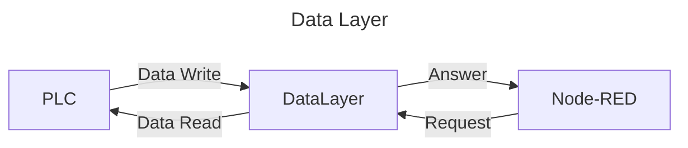

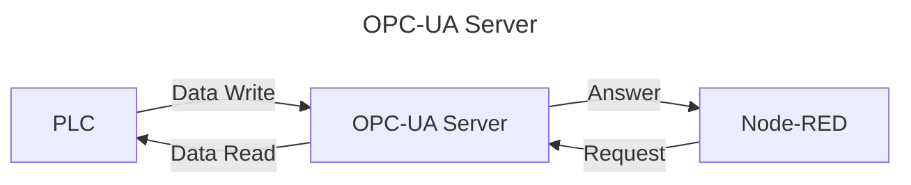

:bulb: It is also possible to have an OPC-UA Client on the IACS for communication between machines.

##### Concretly

<div align="center">
<figure>
    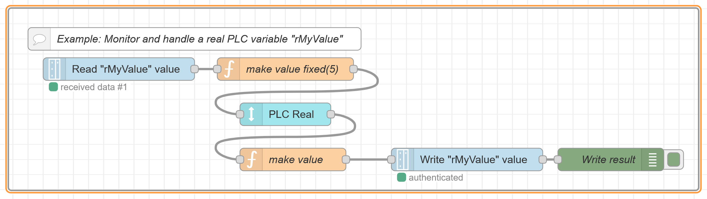
  <figcaption>Write REAL value on PLC from Node-RED</figcaption>
</figure>
</div>

Convert value from **Read**.

```js
// Function make value fixed.
msg.payload = Number(msg.payload.toFixed(5));
return msg
```

Build value to **Write**.

```js
// Make value to write
let newMsg = {}
if (msg.payload.value != null){
    newMsg.payload = {"type":"float","value":Number(msg.payload.value)}
}
else {
    newMsg.payload = {"type":"float","value":Number(msg.payload)}
}
return newMsg;
```

#### Data Layer Method
A method is like to invoke a function in the PLC from Node-RED.

There is a method written in the PLC to add two values.

The Function Block in the PLC looks like that:

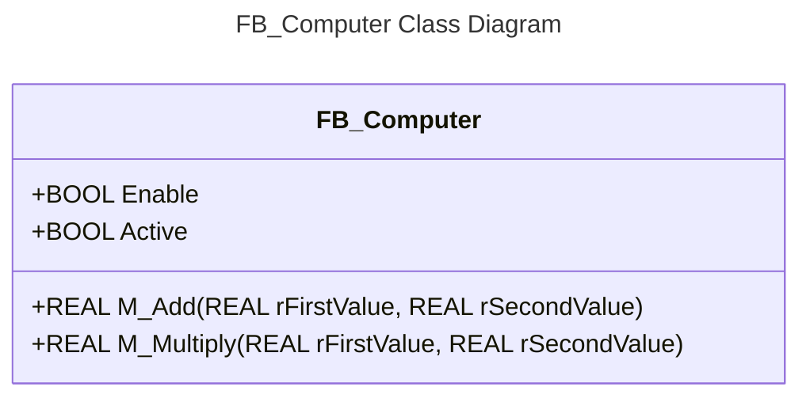

--- 

# Summary
1.  In the lab we will connect Node-RED, the **client** to the PLC, the **server**.
1.  We use services of the package [node-red-contrib-ctrlx-automation](https://flows.nodered.org/node/node-red-contrib-ctrlx-automation).
2.  We use **Data Layer Subscribe** to read variables when they change value, **PLC events**.
3.  We use **Data Layer Request** to:
    1.  Read data on Node-RED events, **READ**.
    2.  Write data on Node-RED events. **WRITE**.
    3.  Invoque methods using **READ with ARGs**.
4. For Subscribe or Request we need a **connection** to the server and a **path** to the objects.

<figure>
    
  <figcaption>ctrlX Automation Request and Subscribe</figcaption>
</figure>

:warning: Depending on the object, we need a function to format the object's data. 

<!-- End of README.md -->
