<h1>
  
  <br> Automation in development and production
    <h2>Subflows</h2>
  <br>
</h1>

Author: [Cédric Lenoir](mailto:cedric.lenoir@hevs.ch)


# Module 06 Node-RED Subflows
1.  [Functions](#writing-functions)
2.  [Variables](#node-red-variables)
3.  [Subflows](#subflow-a-short-introduction)


---

## Writing Functions

The Function node allows JavaScript code to be run against the messages that are passed through it.

The message is passed in as an object called msg. By convention, it will have a ``msg.payload`` property containing the body of the message.

Other nodes may attach their own properties to the message, and they should be described in their documentation.


### Writing a Function

The code entered into the Function node represents the body of the function. The most simple function simply returns the message exactly as-is:

```js
// Code of the function in On Message
// implicitely return msg with payload "The most simple function"
return msg;
```

Example
1.  Drag a function node.
2.  Set name of the function **The most simple function**.
3.  Insert an inject node with message
4.  Add a debug node

<div align="center">
<figure>
  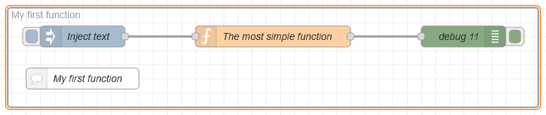
  <figcaption>The most simple function.</figcaption>
</figure>
</div>


<div align="center">
<figure>
  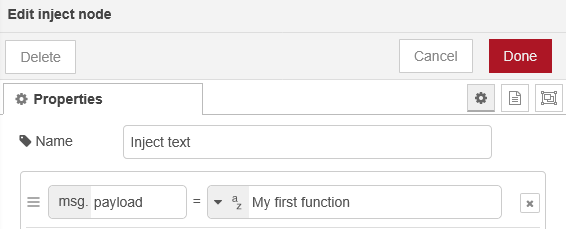
  <figcaption>Inject node "My first function".</figcaption>
</figure>
</div>

If the function returns null, then no message is passed on and the flow ends.

**The function must always return a msg object**. Returning a number or string will result in an error.

The returned message object does not need to be same object as was passed in; the function can construct a completely new object before returning it. For example:

```js
var newMsg = { payload: msg.payload.length };
return newMsg;
```

:bulb: Constructing a new message object will lose any message properties of the received message. In general, function nodes should return the message object they were passed having made any changes to its properties.

Use node.warn() to show warnings in the sidebar to help you debug. For example:

```js
node.warn("my var xyz = " + xyz);
```

See logging section below for more details.

### Multiple Outputs

The function edit dialog allows the number of outputs to be changed. If there is more than one output, an array of messages can be returned by the function to send to the outputs.

This makes it easy to write a function that sends the message to different outputs depending on some condition. For example, this function would send anything a message with payload ``"Sensor One"`` on output one, and anything else on output two.

```js
if (msg.payload === "Sensor One") {
    return [msg, null];
} else {
    node.warn("This is another sensor");
    return [null, msg];
}
```

:warning: Furthermore, a warning is added in the sidebar for debug.

<div align="center">
<figure>
  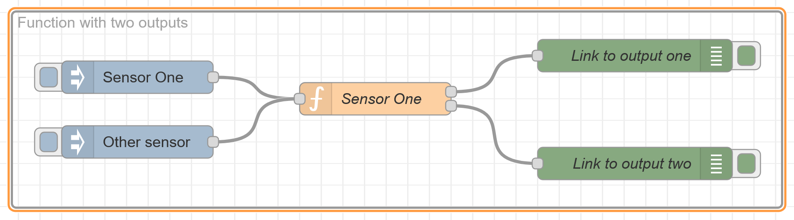
  <figcaption>Function with two outputs".</figcaption>
</figure>
</div>

<div align="center">
<figure>
  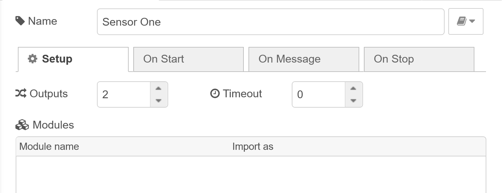
  <figcaption>Select number of outputs in Setup".</figcaption>
</figure>
</div>

:warning: zero or more outputs, but only one input.

The following example passes the original message as-is on the first output and a message containing the payload length is passed to the second output:

```js
var newMsg = { payload: msg.payload.length };
return [msg, newMsg];
```

#### Handling arbitrary number of outputs
:no_bell: *for information only*

node.outputCount contains the number of outputs configured for the function node.

This makes it possible to write generic functions that can handle variable number of outputs set from the edit dialog.

For example if you wish to spread incoming messages randomly between outputs, you could:

```js
// Create an array same length as there are outputs
const messages = new Array(node.outputCount)
// Choose random output number to send the message to
const chosenOutputIndex = Math.floor(Math.random() * node.outputCount);
// Send the message only to chosen output
messages[chosenOutputIndex] = msg;
// Return the array containing chosen output
return messages;
```

You can now configure number of outputs solely via edit dialog without making changes to the function itself.

#### Multiple Messages
:no_bell: *for information only*

A function can return multiple messages on an output by returning an array of messages within the returned array. When multiple messages are returned for an output, subsequent nodes will receive the messages one at a time in the order they were returned.

In the following example, msg1, msg2, msg3 will be sent to the first output. msg4 will be sent to the second output.

```js
var msg1 = { payload:"first out of output 1" };
var msg2 = { payload:"second out of output 1" };
var msg3 = { payload:"third out of output 1" };
var msg4 = { payload:"only message from output 2" };
return [ [ msg1, msg2, msg3 ], msg4 ];
```

The following example splits the received payload into individual words and returns a message for each of the words.

```js
var outputMsgs = [];
var words = msg.payload.split(" ");
for (var w in words) {
    outputMsgs.push({payload:words[w]});
}
return [ outputMsgs ];
```

#### Running code on start

The Function node provides an On Start tab where you can provide code that will run whenever the node is started. This can be used to set up any state the Function node requires.

For example, it can initialise values in local context that the main Function will use:

```js
if (context.get("counter") === undefined) {
    context.set("counter", 0)
}
```

The **On Start** function can return a Promise if it needs to complete asynchronous work before the main Function can start processing messages.

#### Logging events

If a node needs to log something to the console, it can use one of the follow functions:

-   ``node.log("Something happened");``
-   ``node.warn("Something happened you should know about");``
-   ``node.error("Oh no, something bad happened");``

#### Function reference API
:no_bell: *for information only*

The documentation above is what you need for basic applications. For more details you can have a look on the [Node-RED user guide for functions](https://nodered.org/docs/user-guide/writing-functions#writing-a-function).

-   ``node.id`` : the id of the Function node.
-   ``node.name`` : the name of the Function node.
-   ``node.outputCount`` : number of outputs set for Function node
-   ``node.log(..)`` : log a message
-   ``node.warn(..)`` : log a warning message
-   ``node.error(..)`` : log an error message
-   ``node.debug(..)`` : log a debug message
-   ``node.trace(..)`` : log a trace message
-   ``node.status(..)`` : update the node status
-   ``node.send(..)`` : send a message
-   ``node.done(..)`` : finish with a message

##### context

-   ``context.get(..)`` : get a node-scoped context property
-   ``context.set(..)`` : set a node-scoped context property

##### flow

-   ``flow.get(..)`` : get a flow-scoped context property
-   ``flow.set(..)`` : set a flow-scoped context property

##### global

-   ``global.get(..)`` : get a global-scoped context property
-   ``global.set(..)`` : set a global-scoped context property

---

## Node-RED Variables

Global, Flow, Context & Environment Variables.

Variables are essential for building anything beyond basic message routing in Node-RED. They let you store state, share data across your application, and manage configuration—capabilities you'll need for almost any real-world project.

Node-RED provides four types of variables, each with different visibility and use cases.

### What Are Node-RED Variables?

Variables in Node-RED serve as containers for storing and managing data throughout your application. Understanding the different types and their scopes is essential for building efficient, organized flows.

Node-RED offers three primary variable categories:

**Message variables** travel with the message object as it flows through your nodes. The most common example is ``msg.payload``, which carries the primary data between nodes.

These are the variables that we have already used in previous modules, for example to display numerical values ​​via Node-RED Dashboard.

Example of an object message payload:
```js
{"ID":1001,
 "Name":"Axes Velocity",
 "Unit":"m/s",
 "Value":0.1}
```

**Context variables** store application state at different levels—**node**, **flow**, or **global** scope. They persist data that needs to be accessed across multiple message events, making them ideal for tracking counters, storing configuration, or maintaining state.


**Environment variables** handle configuration data and sensitive information like API keys and credentials. By storing this data separately from your flows, you maintain security and make configuration management more flexible.

---

#### Global Variables: Instance-Wide Data Storage

Global variables provide a centralized storage mechanism accessible throughout your entire Node-RED instance. Any function, change, inject, or switch node can read or write global variables, making them perfect for sharing data across multiple flows.

When to use global variables: Consider using them for system-wide settings, shared configuration, or data that multiple flows need to access. For example, in a home automation system with separate flows for lighting, security, and climate control, global variables can store user preferences that all flows reference.

##### Working with Global Variables

Setting global variables can be done through the change node or programmatically in a function node:

Using the change node:

1.  Select **global** from the variable type dropdown
2.  Enter your variable name
3.  Set the value or expression

<div align="center">
<figure>
  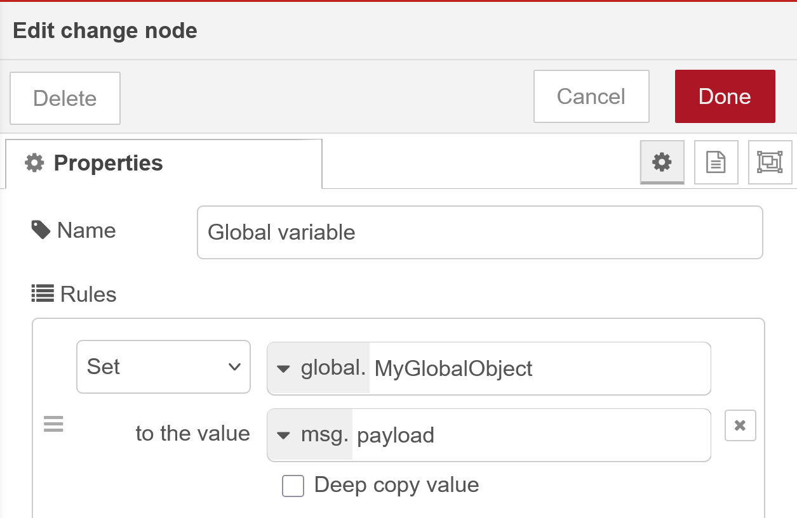
  <figcaption>Build global variable using Change Node</figcaption>
</figure>
</div>

or using a function:

```js
global.set('MyFlowFunctionObject', msg.payload);
```

##### Retrieving global variables
 follows a similar pattern:

In a change, inject, or switch node, simply set the action to **set**, choose the type as **global**, and specify the variable name.

<div align="center">
<figure>
  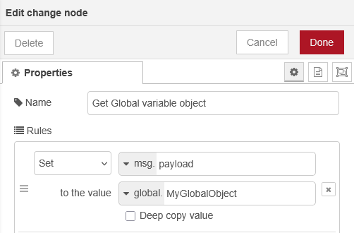
  <figcaption>Read global object with change node.</figcaption>
</figure>
</div>

:bulb: you could access directly to a variable of the global object too.

<div align="center">
<figure>
  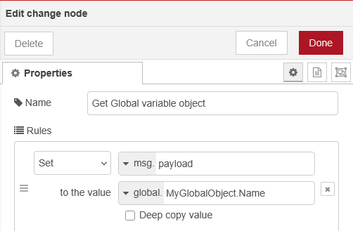
  <figcaption>Read global variable from object with change node.</figcaption>
</figure>
</div>

In function nodes:

```js
const axisVelocity = global.get('MyFlowFunctionObject');
```

Deleting global variables can be accomplished through the change node by selecting **delete** from the action dropdown, or via the Context Data sidebar panel, which provides a comprehensive view of all variables.

<div align="center">
<figure>
  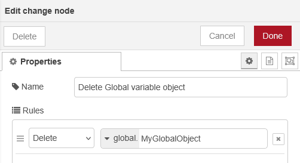
  <figcaption>Delete global variable with change node.</figcaption>
</figure>
</div>

---

#### Flow Variables / Tab-Scoped Data

Flow variables exist within a single tab or flow in your Node-RED editor. They're accessible to all nodes within that specific flow but isolated from other flows, providing logical data separation.

When to use flow variables: Use them for data that's relevant only to a specific workflow. For instance, in a temperature monitoring flow with multiple sensor nodes, flow variables can track the current reading, alert thresholds, or calculation results—data that doesn't need to be shared with other parts of your application.
Working with Flow Variables

##### Setting flow variables:

Using the change node, select the action **set**, choose **flow** as the variable type, and configure your variable.

<div align="center">
<figure>
  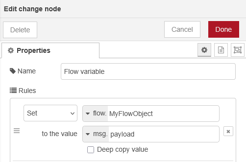
  <figcaption>Build flow object with change node.</figcaption>
</figure>
</div>

of with a function

```js
flow.set('MyFlowFunctionObject', msg.payload);
```

##### Retrieving flow variables

In a change, inject, or switch node, simply set the action to **set**, choose the type as **flow**, and specify the variable name.

<div align="center">
<figure>
  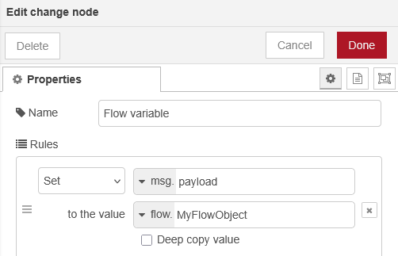
  <figcaption>Read flow object with change node.</figcaption>
</figure>
</div>

or with a variable:

```js
const axisVelocity = flow.get('MyFlowFunctionObject');
```

Deleting flow variables works the same way as global variables—use the change node's delete action or the Context Data panel.

<div align="center">
<figure>
  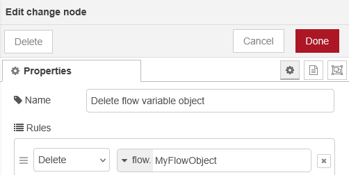
  <figcaption>Delete flow object with change node.</figcaption>
</figure>
</div>

---

#### Node Variables / Node-Level Isolation

Node variables, **also called node context**, are the most restrictive scope—they exist only within a single node. No other node can access or modify these variables, making them ideal for maintaining private state.

When to use node variables: Perfect for counters, temporary calculations, or any data that should remain private to a specific node. For example, a function node that generates unique IDs for database records can maintain a counter variable that's never exposed to other parts of your flow.

##### Working with Node Variables

Node variables are local to a Function node and **cannot be read or modified by other nodes**.

**Setting node variables**
Write that in the On Start of a function node

<div align="center">
<figure>
  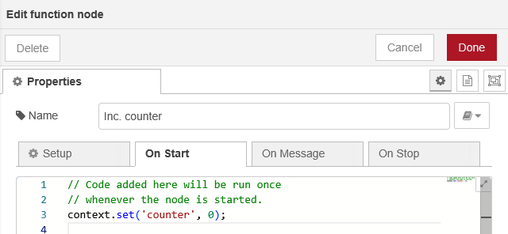
  <figcaption>Edit On Start of a function node.</figcaption>
</figure>
</div>

```js
// Code added here will be run once
// whenever the node is started.
context.set('counter', 0);
```

**Retrieving node variables**
For example in a function:

```js
var _counter = context.get('counter');
_counter++;
context.set('counter', _counter);

msg.payload = _counter

return msg;
```

<div align="center">
<figure>
  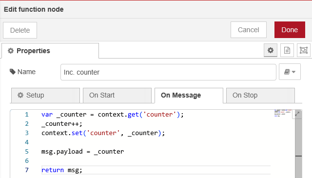
  <figcaption>Edit On Message function node.</figcaption>
</figure>
</div>

<div align="center">
<figure>
  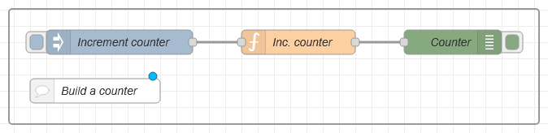
  <figcaption>Build and test the counter.</figcaption>
</figure>
</div>

---

#### Finally
You can use the navigation panel on the right to watch the variables.

<div align="center">
<figure>
  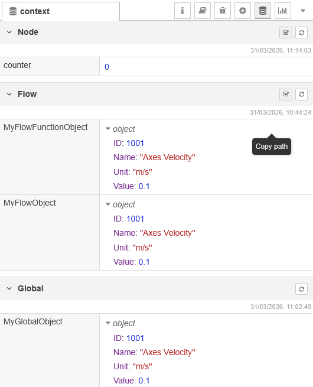
  <figcaption>The context navigation panel.</figcaption>
</figure>
</div>

You will need to refresh the variables to display them.

:bulb: you can delete the variables in  the navigation panel using the trash icon.

---

#### Environment Variables in Node-RED
Predefined data to be used in your Node-RED instance

Programs, written with Node-RED or otherwise, need to sometimes retrieve information that wasn’t decided on during the creation of the program.

Contextual data like configuration, which user is executing the code, differentiate based on what device is executing a flow, or sometimes secrets which shouldn’t be exposed in the code. This is usually done through environment variables. These are pairs of strings, a key with an attached value, which are accessed by their key. Say you want to access an API endpoint with a key, you’d save the key as API_KEY with the value set to yoursupersecretkey. FlowFuse allows setting environment variables. Let’s start using them to understand how they work.

One of the options for the inject node is to inject a env variable, short for; you guessed it: Environment Variable. **In this case** we’re going to one that’s **pre-defined** by Node-RED: **NR_FLOW_NAME**. The name of each variable is in all caps by convention. When connecting this inject to a debug it prints “Subflows” for me, or the name of the flow.

Example, get ``NR_FLOW_NAME``.


<div align="center">
<figure>
  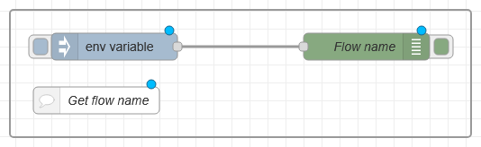
  <figcaption>Get flow name.</figcaption>
</figure>
</div>

<div align="center">
<figure>
  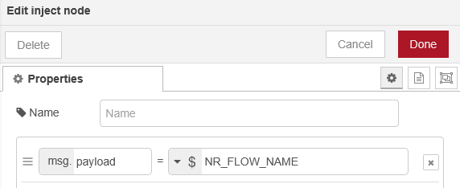
  <figcaption>Set NR_FLOW_NAME to payload.</figcaption>
</figure>
</div>

Using javascript in a function

```js
var newMsg = {}

newMsg.payload = env.get("NR_FLOW_NAME");

return newMsg;
```

Leveraging environment variables can also be done with other nodes, like for example **change**, **switch**. Note however; you can set the **inject** node to output the value even when it doesn’t exist, but it doesn’t allow you to check in the switch node for example if it exists.

Node-RED allows you to set environment variables, **but not to change them when executing flows**. Node-RED doesn’t support Environment Variables like other programming environments do. When the flow is deployed the environment variables are replaced with the known values at that time. This is the biggest gotcha for most developers.

:bulb: For example, the flow name stored in **NR_FLOW_NAME** is a classic Node-RED environment variable. This name is defined during program creation and deployment, and then cannot be changed anymore.

---

#### Built-In Environment Variables

Node-RED defines a set of environment variables for exposing information about the nodes, flows and groups.

This information helps **locate** the node in your workspace. Nodes in your workspace exist as part of a flow. Likewise, a node may, or may not, be part of a group. Nodes, flows and groups are each given unique IDs that are generated by Node-RED. [See below for group](#the-group) if you do not know what it means in Node-RED context.

Nodes, flows and groups all support the name property, which you can change when editing properties.

The following environment variables can be used to access this information for a given node:

- **NR_NODE_ID** - the ID of the node
- **NR_NODE_NAME** - the Name of the node
- **NR_NODE_PATH** - the Path of the node. This represents a node’s position in a flow. It is / delimited IDs of the flow, enclosing subflows, and the node.
- **NR_GROUP_ID** - the ID of the containing group
- **NR_GROUP_NAME** - the Name of the containing group
- **NR_FLOW_ID** - the ID of the flow the node is on
- **NR_FLOW_NAME** - the Name of the flow the node is on
- **NR_SUBFLOW_NAME** - the Name of the containing subflow instance node (since Node-RED 3.1)
- **NR_SUBFLOW_ID** - the ID of the containing subflow instance node (since Node-RED 3.1)
- **NR_SUBFLOW_PATH** - the Path of the containing subflow instance node (since Node-RED 3.1)

Note that while the IDs generated by Node-RED are guaranteed to be unique, the names are not. If a node, flow or group does not have a given name, the corresponding environment variable will be an empty string. If a node is not part of a group, its group id environment variable will also return an empty string.

---


Note: Node-RED variables are not persistent by default.

1. There is a paid option in FlowFuse that would enable this, but in this course, we want to stick to the purely open-source approach.

2.  A second option would be to use Docker. Since the lab machines are not yet equipped with Docker, this option is not documented.

3.  A third option involves using a database or a file. We will cover some of these options later in the course.

---

## Subflow a short introduction

### Table of content

1. Introduction to Subflows
2. Creating Subflows
3. Subflow Configuration
4. Input/Output Nodes
5. Reusing Subflows
6. Best Practices

### Summary

This module covers Node-RED sub-flows, which allow you to encapsulate groups of nodes into reusable components. Learn how to create, configure, and deploy sub-flows to build modular and maintainable automation workflows in development and production environments.

### My first subflow
To take one of the examples above, suppose we want to have a ready-to-use node that, upon injection of a timestamp, returns the name of the flow in a debug window.

#### The group
A simple first solution would be to create a group. Simply select the nodes you're interested in, then right-click, choose Group, and **Group Selection**.

Next, add a comment node to this group. You can then easily copy and paste this group into all the flows where you need this functionality. It's simple, fast, and improves code readability.


<div align="center">
<figure>
  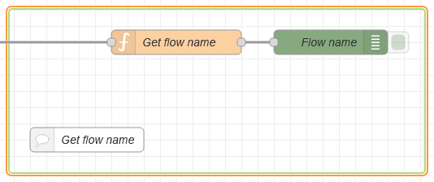
  <figcaption>Get flow name group.</figcaption>
</figure>
</div>

#### The subflow

There is a more compact option that allows you to create a node directly that performs this function, which can then be used like any other node in a palette.

<div align="center">
<figure>
  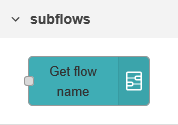
  <figcaption>Node Get flow name.</figcaption>
</figure>
</div>

This node can then be used in any flow. Simply add an inject node to it to display the flow’s name in the debug navigation pane.

The aim here is not to demonstrate a very useful function, namely NR_FLOW_NAME, but rather to understand how to create a simple subflow.

---

## Some exercises

[Link to exercises for module 06](SomeExercises.md), from functions to subflows.


<!-- End of document -->