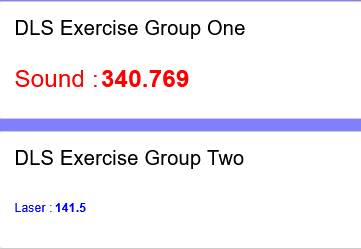
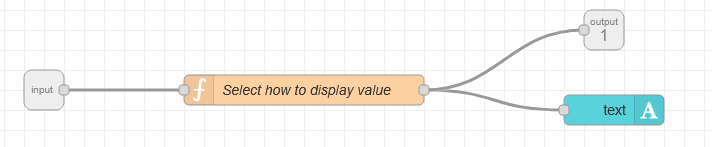
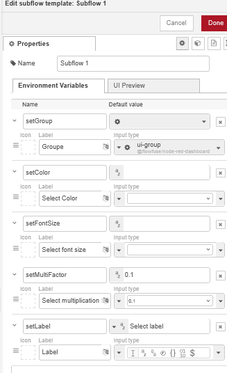
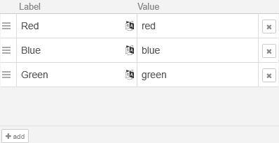
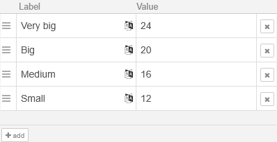
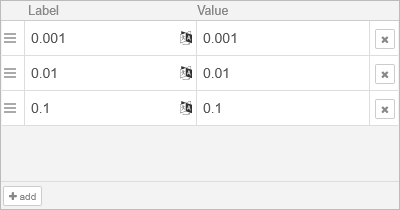
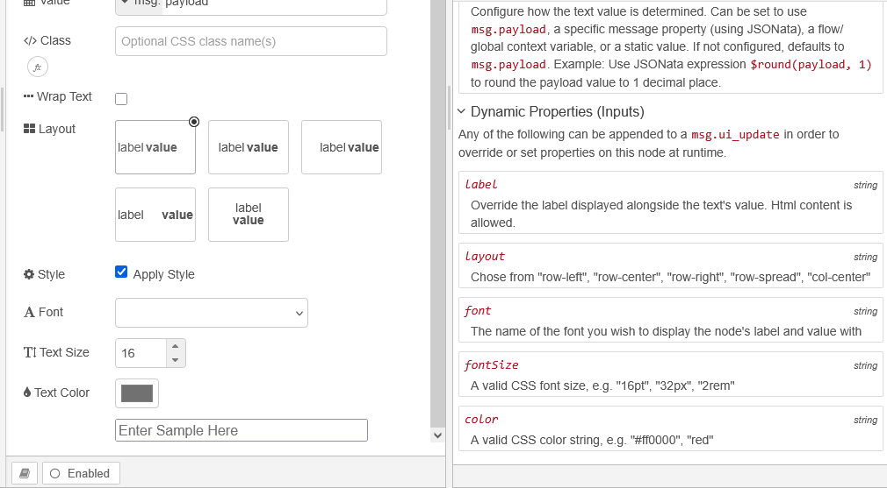
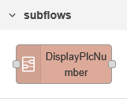
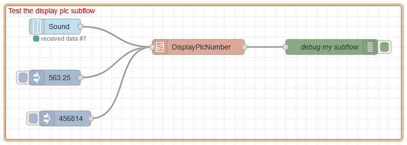
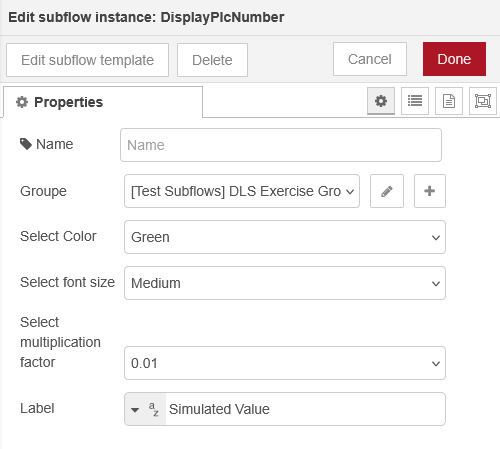

<h1>
  
  <br> Node-RED flows
    <h2>Flow Based Programming</h2>
  <br>
</h1>

Author: [Cédric Lenoir](mailto:cedric.lenoir@hevs.ch)

# Some exercises for Module 06

## Exersice one

In this exercise you will build a subflow with a function to customize the display of an input value, for example from the PLC. At home, you can simulate the input value with an ``Inject`` node. 

### Example of the dashboard

<div align="center">
<figure>
  
  <figcaption>Result of the exercise.</figcaption>
</figure>
</div>

### Create the subflow
-   In the upper right corner of the node-red editor, select **Subflows**, the Create Subflow.
-   In the subflow, insert a function, a text node an input and one output.

<div align="center">
<figure>
  
  <figcaption>Subflow with function and text node.</figcaption>
</figure>
</div>

In the upper left corner of the subflow editor, select **edit properties**, 

<div align="center">
<figure>
  
  <figcaption>Edit subflow template.</figcaption>
</figure>
</div>

The environment variables are the parameters you can use to customize the subflow.

The first variable, allow you to select the group of the UI, then

<div align="center">
<figure>
  
  <figcaption>Set font color, see dynamic properties below.</figcaption>
</figure>
</div>

<div align="center">
<figure>
  
  <figcaption>Set font size, see dynamic properties below.</figcaption>
</figure>
</div>

Sometime, the sensor gives you the number from the PLC has not the right format you want to display, for example, an ultrasonic sensor gives you micrometers when you want to display millimeters. You will have **to multiply this value by 0.001 for the display**.

<div align="center">
<figure>
  
  <figcaption>The multiplication factor allow you to resize the number.</figcaption>
</figure>
</div>

Finally, you will write your sensor name when inserting the subflow in your node-red editor.

### Dynamic properties of a widget

To edit the dynamic properties of a widget, here: a ``text node``.
-   Select the *book icon* at the left bottom of the edit icon. See image below.
-   To modify the font, you have to select *Apply style*.

<div align="center">
<figure>
  
  <figcaption>Dynamic properties of the text node.</figcaption>
</figure>
</div>

### The function
In the function, you can use the environment parameters to customize the message to send to the text node.

:bulb: please, try to understand the code below, use an IA if needed. You do not need to know the syntax, but your should be able to modify it for different uses

```js
var getNumber = 1;

// We create a ui_update object
msg.ui_update = {};
// Add : to your label
msg.ui_update.label = env.get("setLabel") + " :";

msg.ui_update.color = env.get("setColor");
msg.ui_update.fontSize  = env.get("setFontSize");

// Convert multiplication factor from text to number
getNumber = Number(env.get("setMultiFactor"));

msg.payload = msg.payload * getNumber;

return msg;
```

### Test the subflow
If you cannot connect the subflow to a PLC, at home, you can simulate input values.

<div align="center">
<figure>
  
  <figcaption>Subflows in the upper left corner of the editor.</figcaption>
</figure>
</div>

<div align="center">
<figure>
  
  <figcaption>Test DisplayPlcSubflow.</figcaption>
</figure>
</div>

You can now configure your subflow and instantiate it as many times as you like.

<div align="center">
<figure>
  
  <figcaption>Edit subflow instance.</figcaption>
</figure>
</div>

### To remember
If subflows are not very useful for very small projects, It is a very powerful tool as soon as you have to do many times the same things and your project starts to grow.
-   Your code will be more robust, once the subflow is tested, every new instance has not to be tested in details.
-   The project is easier to maintain, only one object to modify if needed.
-   Easier to read.

These are the words of a student who completed his bachelor's thesis with Node-RED: <b style='color:red;'>I would never have been able to finish on time without using subflows.

<!-- End of document -->