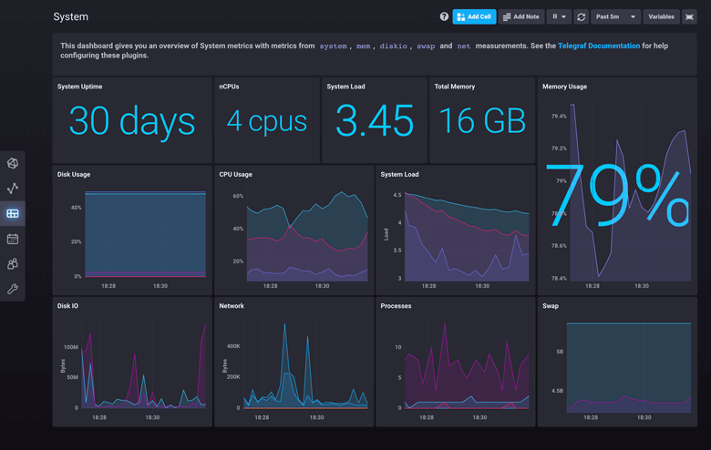
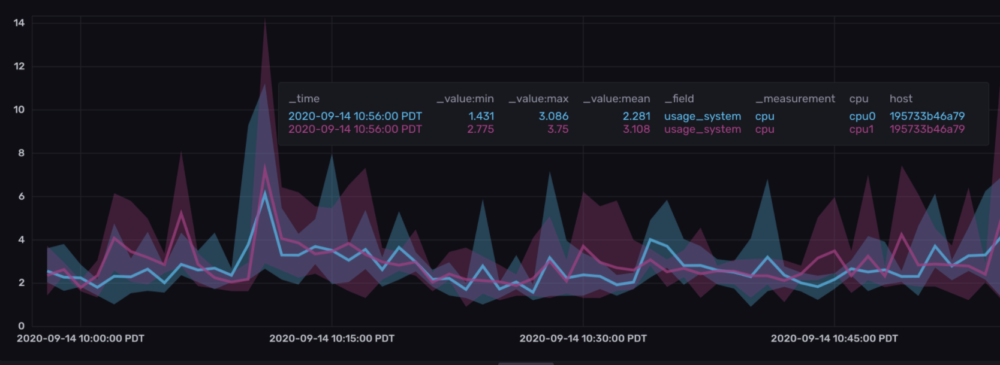
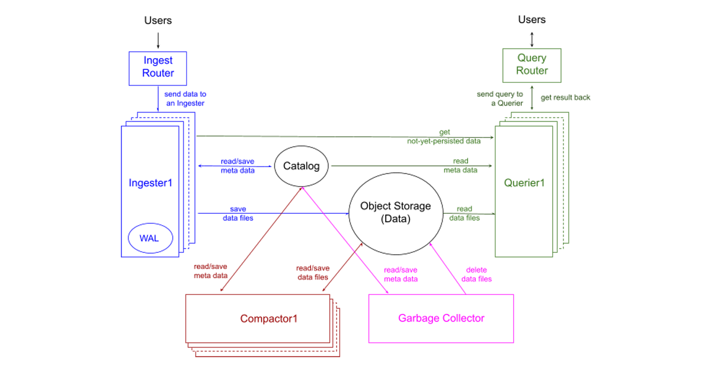
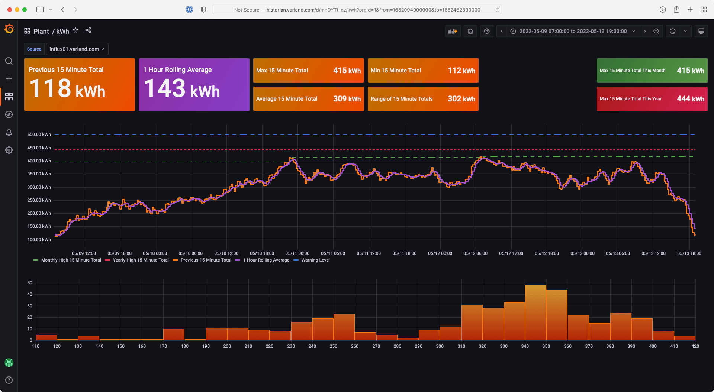
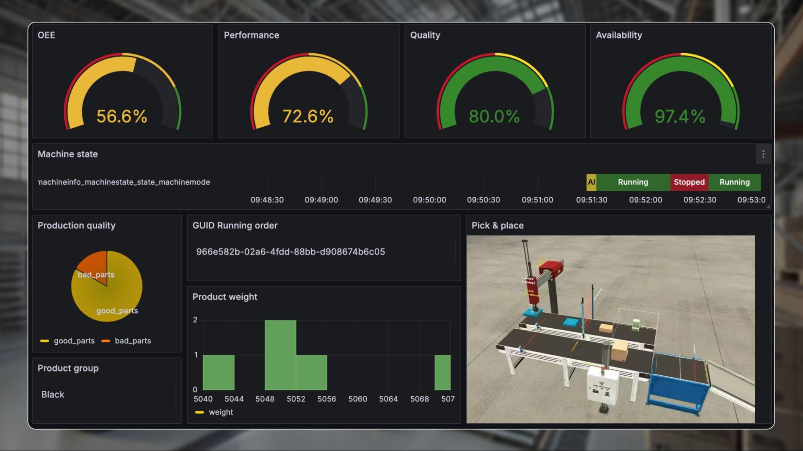
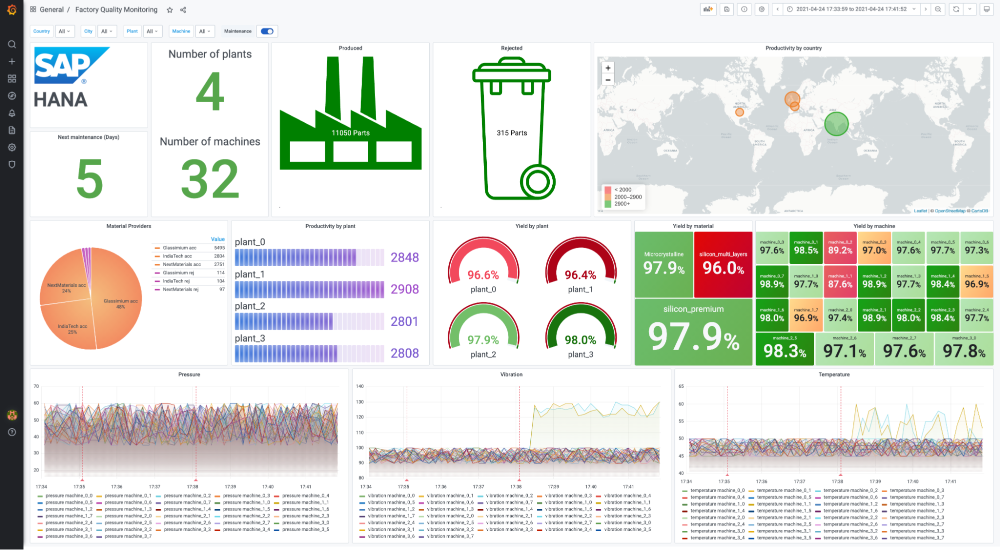

<h1>
  
  <br> Automation in development and production
    <h2>Interfaces</h2>
  <br>
</h1>

Author: [Cédric Lenoir](mailto:cedric.lenoir@hevs.ch)

<b style='color:red;'>Draft</b>

# Module 09 InfluxDB + Grafana

The combination of **Node-RED + InfluxDB + Grafana** is very common in **IIoT**, **industrial automation**, and **process data monitoring**.

Each tool has a different and complementary role.

---

## 1. Node-RED: Collecting and Processing Data

[Image](https://flowfuse.com/img/early-node-red-screenshot-ZfB4zc-skd-650.jpeg)

[Image](https://www.industrialshields.com/web/image/386190/node-red-example-flows.jpg?access_token=b9c24f67-92b7-41be-a9c3-355507da6fe4)

[Image](https://www.mdpi.com/energies/energie) s-16-02092/article_deploy/html/images/energies-16-02092-g001.png)


**Node-RED** serves as **acquisition and logic middleware**.

Typical Functions:

* Connection to equipment:

* OPC UA
* Modbus
* MQTT
* REST API
* PLC (e.g., CtrlX, Siemens, etc.)
* Data processing:

* Filtering
* Aggregation
* Format transformation
* Simple logic automation

Example in a machine:

```
PLC → Node-RED → Processing → Storage
```

Node-RED is very practical because:

* Visual programming via streams
* Very quick to prototype
* Many industrial connectors

---

## 2. InfluxDB: Storing data temporal

<div align="center">
<figure>
  
  <figcaption>Pre canned dashboard</figcaption>
</figure>
</div>

<div align="center">
<figure>
  
  <figcaption>Visualizations band example</figcaption>
</figure>
</div>

<div align="center">
<figure>
  
  <figcaption>InfluxDB 3.0 System Architecture</figcaption>
</figure>
</div>

**InfluxDB** is a **database optimized for time series**.

It is ideal for storing:

* temperatures
* pressures
* speeds
* machine states
* counters
* alarms

Because it handles very well:

* **millions of measurement points**
* **precise timestamps**
* **time-based queries**

Example of stored data:

```
temperature, machine=M1 value=78.2 1710063000
```

InfluxDB is much better than a traditional SQL database for this type of data.

---

## 3. Grafana: visualize and analyze

<div align="center">
<figure>
  
  <figcaption>Grafana dashboard</figcaption>
</figure>
</div>

<div align="center">
<figure>
  
  <figcaption>IIoT and Grafana Dashboard</figcaption>
</figure>
</div>

<div align="center">
<figure>
  
  <figcaption>Integration with a lot of systems, e.g. SAP</figcaption>
</figure>
</div>

Grafana is used to visualize data.

It allows you to easily create:

* Real-time dashboards
* Historical data
* Production KPIs
* Alarms

Examples of graphs:

* Temperature trend
* Production rate
* Cycle time
* Machine availability

Grafana connects directly to InfluxDB.

---

## 4. Typical Architecture

In an industrial or IoT system:

```
PLC / Sensors
│
│ OPC UA / MQTT / Modbus
▼
Node-RED
│
│ write
▼
InfluxDB
│
│ query
▼
Grafana
```

---

## 5. Why use all three together?

| Tool | Role |

| -------- | ----------------------------- |
| Node-RED | acquisition and logic |

| InfluxDB | optimized time-series storage |

| Grafana | visualization and dashboards |

Advantages:

* **Modular** architecture
* **Widely used open-source tools**
* Excellent for **IIoT / Industry 4.0**
* **Real-time + historical data**
* Easy to connect with PLCs and APIs

---

## 6. Concrete example in automation (e.g., ctrlX)

Possible architecture with **ctrlX OS**:

```
CtrlX PLC

│
│ OPC UA
▼
Node-RED (node-red-contrib-ctrlx-automation)

│
│ InfluxDB node
▼
InfluxDB

│
▼
Grafana
```

Result:

* Historical PLC variables
* Production dashboard
* Machine performance analysis

---

💡 **In summary:**

* **Node-RED = data collection / orchestration**
* **InfluxDB = measurement storage**
* **Grafana = visualization**

It's a **very lightweight and powerful IIoT stack**.

---

If you'd like, I can also show you:

* **a typical Node-RED → InfluxDB flow**
* or **an example for logging PLC variables (OPC UA / ctrlX)**.
